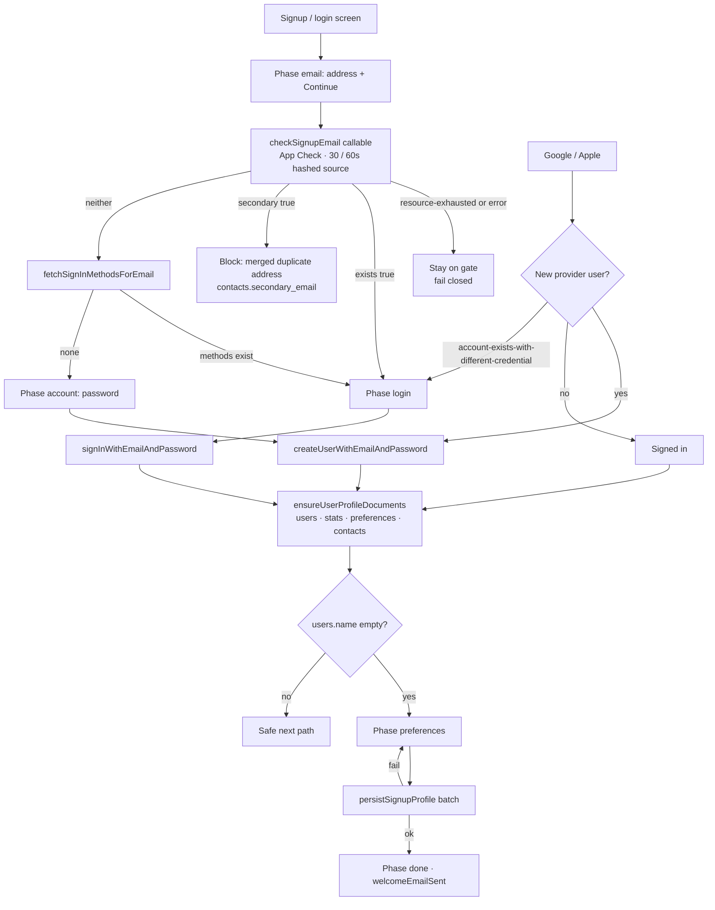

# Account creation

Email gate, Auth account, bootstrap, completion, and the duplicate-address block. Swimlanes are
Browser, Auth, Functions.

```mermaid
flowchart TB
    start["Signup / login screen"] --> email["Phase email: address + Continue"]
    email --> lookup["checkSignupEmail callable<br/>App Check · 30 / 60s hashed source"]
    lookup -->|resource-exhausted or error| failClosed["Stay on gate<br/>fail closed"]
    lookup -->|exists true| login["Phase login"]
    lookup -->|secondary true| block["Block: merged duplicate address<br/>contacts.secondary_email"]
    lookup -->|neither| authMethods["fetchSignInMethodsForEmail"]
    authMethods -->|methods exist| login
    authMethods -->|none| password["Phase account: password"]

    login --> signIn["signInWithEmailAndPassword"]
    password --> create["createUserWithEmailAndPassword"]

    oauth["Google / Apple"] --> oauthNew{"New provider user?"}
    oauthNew -->|yes| create
    oauthNew -->|no| signedIn["Signed in"]
    oauthNew -->|account-exists-with-different-credential| login

    create --> bootstrap["ensureUserProfileDocuments<br/>users · stats · preferences · contacts"]
    signIn --> bootstrap
    signedIn --> bootstrap
    bootstrap --> incomplete{"users.name empty?"}
    incomplete -->|yes| prefs["Phase preferences"]
    incomplete -->|no| app["Safe next path"]
    prefs --> persist["persistSignupProfile batch"]
    persist -->|ok| done["Phase done · welcomeEmailSent"]
    persist -->|fail| prefs
```
