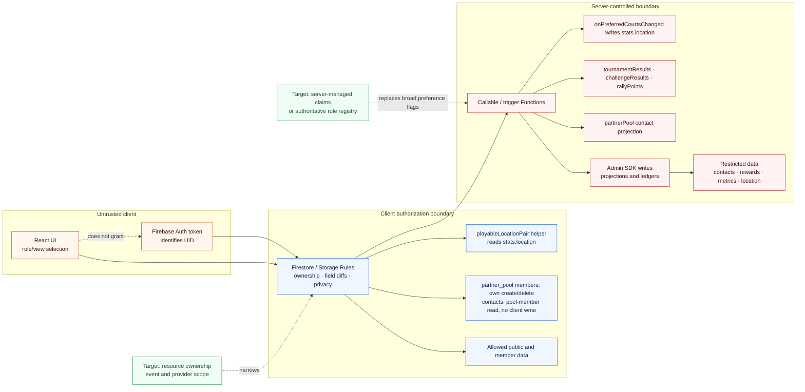

# Authorization boundaries

Identity, UI role state, Rules, and Functions provide different guarantees. Only the backend
controls grant privileged authority.

`stats.location` is not client-writable. Cross-location play is enforced on the
`challengeResults` callable today. The Rules helper exists; wire it into match `allow create`
before claiming create-time refusal in production Rules.
