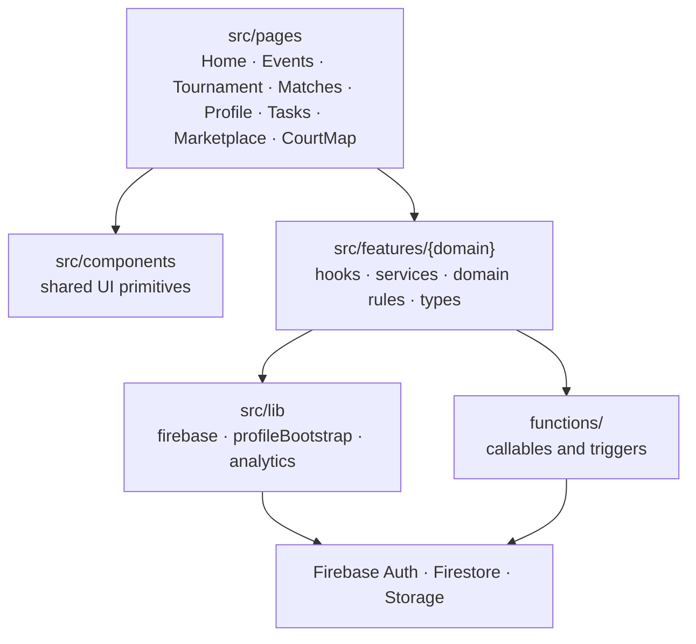

# Client layer map

Intended dependency direction. The app is partway through this shape: tournament scoring, signup
validation, event registration, courts, partner pool, and rally services already sit under
`src/features/`. Some page modules still keep compatibility exports.

| Layer            | Owns                                                            | Must not own                                   |
| ---------------- | --------------------------------------------------------------- | ---------------------------------------------- |
| Pages            | Route composition, screen layout                                | Firestore field names, scoring formulas, Rules |
| Feature domain   | Pure rules (scoring, placement, location helpers on the client) | Network calls                                  |
| Feature services | Document reads/writes, callable wrappers                        | JSX                                            |
| Functions        | Privileged transitions, projections, points                     | UI                                             |

Evidence: `docs/engineering/MAINTAINABILITY.md`, `src/features/tournament/`,
`src/features/events/`, `src/features/rallies/`, `src/features/partnerPool/`,
`src/features/courts/`, `src/features/signup/`.
