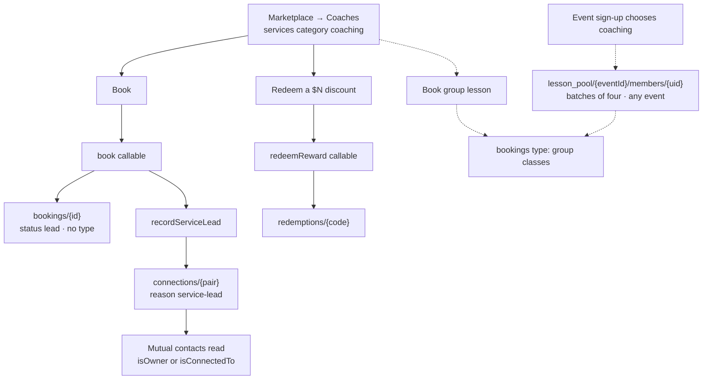

# Coaching pool

Current Marketplace actions (solid) versus the documented D8 S5 target (dashed). The
`lesson_pool` collection and **Book group lesson** action are not built.

```mermaid
flowchart TB
    catalog["Marketplace → Coaches<br/>services category coaching"] --> bookUI["Book"]
    catalog --> redeemUI["Redeem a $N discount"]

    bookUI --> bookFn["book callable"]
    bookFn --> booking["bookings/{id}<br/>status lead · no type"]
    bookFn --> lead["recordServiceLead"]
    lead --> conn["connections/{pair}<br/>reason service-lead"]
    conn --> contacts["Mutual contacts read<br/>isOwner or isConnectedTo"]

    redeemUI --> redeemFn["redeemReward callable"]
    redeemFn --> coupon["redemptions/{code}"]

    joinEvent["Event sign-up chooses coaching"] -.-> pool["lesson_pool/{eventId}/members/{uid}<br/>batches of four · any event"]
    catalog -.-> bookGroup["Book group lesson"]
    bookGroup -.-> typed["bookings type: group classes"]
    pool -.-> typed
```
