# Core data flow

Where the browser reads or initiates work, and where Functions maintain protected projections.

```mermaid
flowchart TB
    subgraph signup["1 · Signup and profile bootstrap"]
        signupPage["Signup / provider sign-in"] --> lookup["checkSignupEmail<br/>throttle + secondary_email"]
        lookup --> authState["AuthContext observes identity"]
        authState --> profile["ensureUserProfileDocuments"]
        profile --> memberDocs["users · stats · preferences · contacts"]
        memberDocs --> complete["persistSignupProfile if name empty"]
    end

    subgraph eventFlow["2 · Event join, draw, score, advancement"]
        memberReads["Member reads events"] --> join["Create event_participants"]
        join --> courts["Preferred court → derived zone or Unplaced"]
        courts --> draw["Organizer configures event / RR draft"]
        draw --> fixtures["Generate matches"]
        fixtures --> score["Players report score intent"]
        score --> callable["applyTournamentResult callable"]
        callable --> ranking["stats and ranking_history"]
    end

    subgraph locationFlow["3 · Location derivation"]
        courtsChange["preferences.preferred_courts write"] --> locFn["onPreferredCourtsChanged"]
        locFn --> statsLoc["stats.location = Toronto or deleted"]
    end

    subgraph playFlow["4 · Challenge and rally"]
        openMatch["Player creates open rally / challenge"] --> accept["Opponent accepts"]
        accept --> report["Player reports score"]
        report --> confirm["Second party or manager confirms"]
        confirm --> challengeCall["challengeResults callable<br/>assertPlayableLocationPair"]
        confirm --> rallyPay["onRallyConfirmedAwardPoints"]
    end

    subgraph poolFlow["5 · Partner pool"]
        joinPool["Client creates own members/{uid}"] --> project["onPartnerPoolJoin writes contacts/{uid}"]
        project --> notifyPool["Notify same-category members"]
        leavePool["Client deletes own membership"] --> drop["onPartnerPoolLeave deletes projection"]
    end

    subgraph rewardFlow["6 · Tasks, points, rewards"]
        activity["Task claim / check-in / attendance / report"] --> trigger["Firestore trigger validates activity"]
        trigger --> ledger["Functions write progress and award ledger"]
        ledger --> offer["Client reads offers projection"]
        offer --> redeem["Callable redemption workflow"]
    end

    subgraph listingFlow["7 · Listing and contact reveal"]
        upload["Upload listing image"] --> listing["Create listing document"]
        listing --> moderation["moderateUploadedImage"]
        listing --> marker["Maintain public_contacts marker"]
        marker --> buyer["Signed-in buyer uses listing path"]
        buyer --> protectedContact["Rules protect contacts/{uid}"]
    end

    subgraph notifications["8 · Notifications and email"]
        transition["Protected state transition"] --> inApp["Recipient notification"]
        transition --> emailPrefs["Load opt-out and contact data"]
        emailPrefs --> resend["Resend transactional email"]
    end

    subgraph coachingFlow["9 · Coaching and bookings"]
        catalog["Active services catalog"] --> bookBtn["Book"]
        catalog --> redeemBtn["Redeem a $N discount"]
        bookBtn --> bookCall["book callable → bookings lead"]
        bookCall --> serviceLead["service-lead connection"]
        redeemBtn --> redeemCall["redeemReward"]
        catalog -.-> bookGroup["Book group lesson / lesson_pool<br/>documented, not built"]
    end

    classDef browserNode fill:#fff7ed,stroke:#c2410c,color:#431407
    classDef firebaseNode fill:#eff6ff,stroke:#2563eb,color:#172554
    classDef protectedNode fill:#fef2f2,stroke:#b91c1c,color:#450a0a
    class signupPage,complete,memberReads,openMatch,joinPool,leavePool,activity,upload,buyer,catalog,bookBtn,redeemBtn browserNode
    class lookup,authState,profile,memberDocs,join,courts,draw,fixtures,score,courtsChange,accept,report,offer,listing,marker,protectedContact,inApp,emailPrefs firebaseNode
    class callable,ranking,locFn,statsLoc,challengeCall,rallyPay,project,notifyPool,drop,trigger,ledger,redeem,moderation,transition,resend,confirm,bookCall,serviceLead,redeemCall,bookGroup protectedNode
```

Tournament, challenge, and rally **points** are server-authoritative. The remaining risk is
incomplete Rules coverage (BUG-507 rally-report evaluator error) and Functions emulator
timeouts (BUG-508), not a second client stats authority for those paths.
