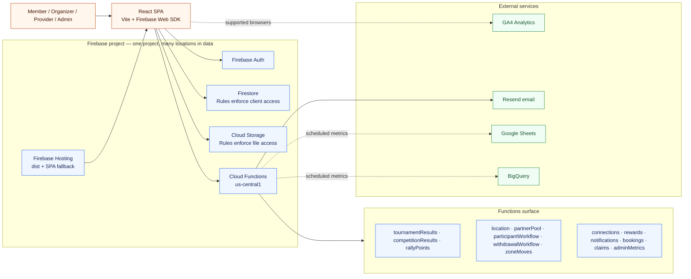

# Current system architecture

The browser is the product client. Firebase Rules and Functions are the effective backend
boundaries. UI role selection is not an authorization boundary. **Location is a data dimension
on member stats**, not a second Firebase project.

Current evidence: `src/lib/firebase.ts`, `src/App.tsx`, `functions/index.js`,
`functions/lib/constants.js`, `firebase.json`, `.firebaserc`. Last verified SHA `dc111f22`.
