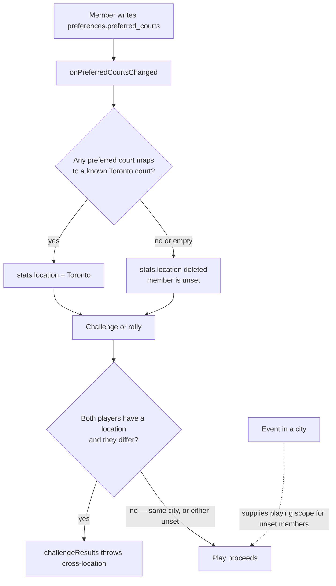

# Location scoping

A **location** is a city (today: Toronto). It is not the `events.location` court-name field and
not a Firebase project. Zones belong to a city; they are not walls.

## Rules of the current checkout

| Rule          | Current behavior                                                                                                                                                                    |
| ------------- | ----------------------------------------------------------------------------------------------------------------------------------------------------------------------------------- |
| Derivation    | `functions/lib/memberLocation.js` maps preferred courts through generated `functions/courts.json` (from the shipped CSV). Only Toronto exists. Unknown courts leave location unset. |
| Storage       | `stats/{uid}.location` is written by `functions/location.js`. Clients cannot create or update that field (`firestore.rules` stats allowlist).                                       |
| Play          | `functions/lib/playLocation.js` `assertPlayableLocationPair`: same city allowed; one or both unset allowed; two different cities refused.                                           |
| Where it runs | `functions/competitionResults.js` (`challengeResults` callable) on result submit.                                                                                                   |
| Cross-zone    | Allowed inside a location. Zones are court convenience, not a play wall.                                                                                                            |
| Second city   | A Markham or Brampton event creating a live location is M9 / [TASK-674](../../development/task/TASK-674-DETAILS.md). Not in this checkout.                                          |

Evidence: `functions/location.js`, `functions/lib/memberLocation.js`, `functions/lib/playLocation.js`,
`functions/competitionResults.js`, `firestore.rules` (`playableLocationPair`, stats match),
`functions/test/memberLocation.test.js`. SHA `dc111f22`.
