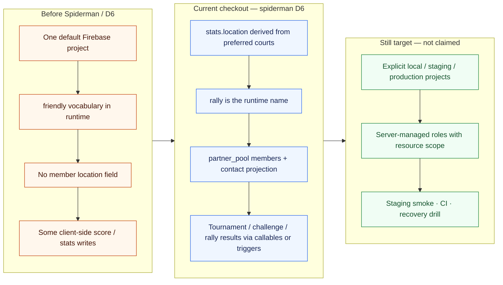

# Current versus target modernization

The target preserves the product topology while making environments, authority, and evidence
explicit. D6 on `spiderman` moved several “after” items into the current checkout without
claiming staging or production.

This is not a claim that staging, complete rules coverage, or production deployment readiness
already exists. D6 is implementation-complete and not green-closed (BUG-507, BUG-508).
