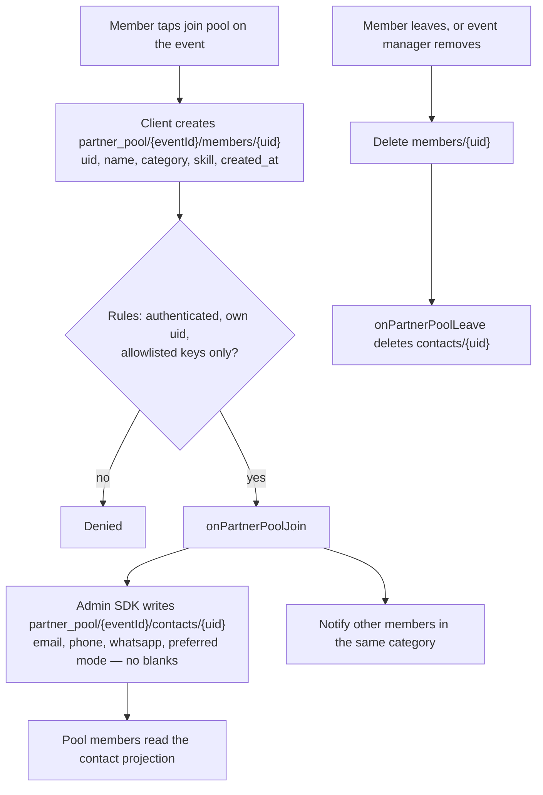

# Partner pool

The doubles partner pool is **per event**. Membership is a client document; contact details are a
server projection so the pool is not a public phone directory.

## Access

| Path                                    | Client read                                         | Client write                                                 |
| --------------------------------------- | --------------------------------------------------- | ------------------------------------------------------------ |
| `partner_pool/{eventId}/members/{uid}`  | Any signed-in user                                  | Create/delete own membership. Manager may delete. No update. |
| `partner_pool/{eventId}/contacts/{uid}` | Only if the caller is a member of that event's pool | None. Functions only.                                        |

Category is the doubles division (`poolCategoryForDivision`). Join-from-sheet can add the member
to the pool in the same action as event registration.

Evidence: `firestore.rules` partner-pool match, `functions/partnerPool.js`,
`functions/lib/partnerPool.js`, `src/features/events/services/partnerPool.ts`,
`src/features/partnerPool/usePool.ts`, `tests/rules/firestore.rules.test.mjs`.
