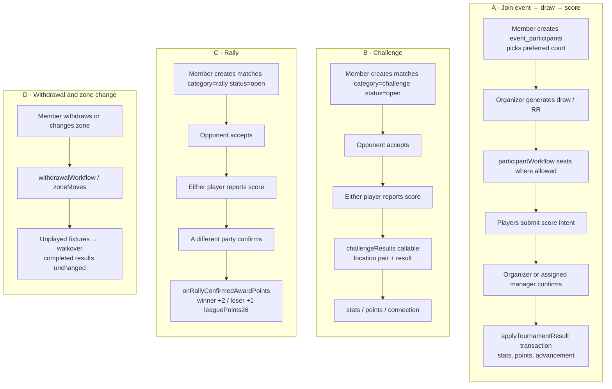

# Play loops

Four loops a member actually runs. Swimlanes are Member, Organizer, Functions.

| Loop            | Member                                            | Organizer             | Functions                             |
| --------------- | ------------------------------------------------- | --------------------- | ------------------------------------- |
| Join / score    | Join, pick court, report intent                   | Draw, confirm result  | Seating, `applyTournamentResult`      |
| Challenge       | Create, accept, report                            | May submit as manager | `challengeResults` + location check   |
| Rally           | Create, accept, report, **second party confirms** | Admin may confirm     | `rallyPoints` on confirmed transition |
| Withdraw / zone | Request                                           | Notified              | Walkovers for unplayed fixtures       |

Rally confirmation by the same reporter is refused in Rules; that check is what stops
self-minted points. BUG-507 is a Rules evaluator failure on a valid rally-report update.
