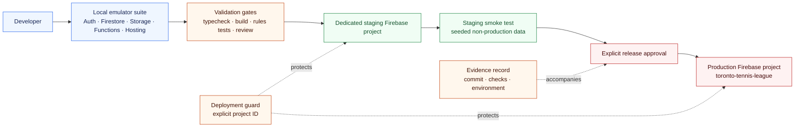

# Target safe delivery architecture

This is the **delivery target**, not the current checkout. Current work runs against the local
emulator project `rands-local`. Staging does not exist until the owner names an isolated
Firebase project.

A Hosting preview channel alone does not create a separate database, Functions runtime, or
Storage environment.
