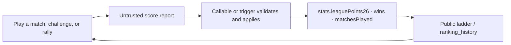

# Scoring and points

## No-show precedence

> **Retired by ruling 2 (2026-08-29); code cleanup pending.** There is no no-show concept. The
> word was deleted along with `Scheduled`, and a member sees only `Pending` and `Done`. The rule
> below still describes how the code behaves today and is removed by
> [D6 C9](../planning/sprints/d6-d9/SPRINT-D6.md). Do not build anything new against it.

**Rule:** A no-show is evaluated before winner or walkover logic. Both players receive one point;
there is no winner, score, win/loss, or played-match credit.

**Why:** A no-show and a walkover can both have all-zero games, but they have different business
meaning and different advancement consequences.

**Important exception:** No-show reversal removes the same one-point award and does not attempt to
reverse winner/loser statistics.

**Code:** `src/features/tournament/domain/scoring.ts`,
`src/pages/tournament/useTournament.ts`.

**Regression test:** `tests/unit/domain.test.mjs`.

## Match awards

**Rule:** A Round Robin group-stage winner receives three points immediately and the loser receives
one. Knockout winner points are applied only in the final; the loser award follows the established
round table: R32=1, R16=2, QF=3, RR=1, SF=5, F=10.

**Why:** Group-stage standings and knockout progression use different point timing while sharing
one calculation.

**Important exception:** A walkover has a winner and follows normal winner/loser handling even
when its game fields are zero.

**Code:** `src/features/tournament/domain/scoring.ts` and its compatibility export in
`src/pages/tournament/utils.ts`.

**Regression test:** `tests/unit/domain.test.mjs`; client counter-minting protections in
`tests/rules/firestore.rules.test.mjs`.

## Rally result confirmation

> `Rally` is the canonical term. Runtime source, Rules, and Functions use `category: 'rally'`.
> `friendly` is retired display and identifier vocabulary.

**Rule:** A rally report must identify the authenticated reporter, name one of the two match
players as winner, and use bounded integer set scores. Points are paid only after a different party
confirms the report. Winner +2 `leaguePoints26`, loser +1; neither loses points.

**Why:** A client-visible result is untrusted input; accepting an arbitrary winner or self-confirmed
report would mint redeemable points.

**Important exception:** Legacy `claimed_winner_uid` documents remain readable by the Functions
trigger while older records are being retired. Cross-location pairs are refused by
`challengeResults` (`assertPlayableLocationPair`); an unset location may still play.

**Code:** `firestore.rules`, `functions/lib/rallyResult.js`, `functions/rallyPoints.js`,
`functions/competitionResults.js`, `functions/lib/playLocation.js`.

**Regression test:** `tests/rules/firestore.rules.test.mjs` and `functions/test/rallyResult.test.js`.
BUG-507 currently fails the valid rally-report Rules case.

## Points feedback loop

