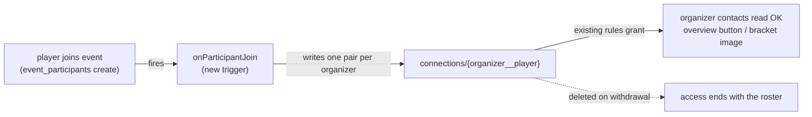

# dev-anuj Branch Conflicts

|                  |                                                                                                                                                        |
| ---------------- | ------------------------------------------------------------------------------------------------------------------------------------------------------ |
| **Date**         | 2026-08-21 (revised 2026-08-22)                                                                                                                        |
| **Scope**        | Code conflicts on the `dev-anuj` branch only. Product decisions live in `DECISIONS_BRIEF.md`; remodel corrections in `HARMONIZATION_REPORT.md`.        |
| **Environments** | `tbtctennis/Racquets-And-Strings` + `dev-anuj` is the **test environment**; the owner's repository on the `toronto-tennis-league` project is **live**. |
| **Code links**   | Permalinks to `dev-anuj` `3f40773`.                                                                                                                    |
| **Status**       | `BROKEN` fails at runtime · `GAP` required behaviour missing · `TRAP` operational hazard · `RESOLVED` decided                                          |

## 1. Organizer score editing — `BROKEN`

- **Required:** the organizer records a result and re-edits it any number of times; latest stands, `result_at` stamped, `completed_at` pinned at first scoring, every edit logged.
- **Today:** the callable refuses a different result on a completed match ("Reset it before rescoring") while reset and cancel are disabled stubs — a mis-scored match is uncorrectable.
- **Lands:** [`tournamentResults.js#L100`](https://github.com/tbtctennis/Racquets-And-Strings/blob/3f40773/functions/tournamentResults.js#L100) (reverse-then-reapply in the same transaction) · [`lib/tournamentResult.js#L166`](https://github.com/tbtctennis/Racquets-And-Strings/blob/3f40773/functions/lib/tournamentResult.js#L166) (`mergeStatDeltas(…, -1)`, test-only today) · [`useTournament.ts#L1687`](https://github.com/tbtctennis/Racquets-And-Strings/blob/3f40773/src/pages/tournament/useTournament.ts#L1687), [`#L1481`](https://github.com/tbtctennis/Racquets-And-Strings/blob/3f40773/src/pages/tournament/useTournament.ts#L1481), [`#L2472`](https://github.com/tbtctennis/Racquets-And-Strings/blob/3f40773/src/pages/tournament/useTournament.ts#L2472) (stubs → edit flow).
- **Done when:** two successive edits leave stats equal to a fresh recompute; `completed_at` unchanged; a replayed identical edit is a no-op.

## 2. Set-score bounds — `GAP`

- **Required:** integers 0–99; above 10 the margin is exactly 2 (10-4, 24-22, 38-40 valid · 12-2, 40-0, 90-40 invalid); walkover all zeros; winner takes the set majority.
- **Today:** the server accepts any 0–99 margin (12-2 passes); the rules cap player submissions at 0–7 (8-4, 24-22 rejected).
- **Lands:** [`lib/tournamentResult.js#L1`](https://github.com/tbtctennis/Racquets-And-Strings/blob/3f40773/functions/lib/tournamentResult.js#L1) · [`firestore.rules#L118`](https://github.com/tbtctennis/Racquets-And-Strings/blob/3f40773/firestore.rules#L118) (`boundedScore`) · [`scoreSubmission.ts`](https://github.com/tbtctennis/Racquets-And-Strings/blob/3f40773/src/features/tournament/domain/scoreSubmission.ts) (form validation).
- **Done when:** the twelve examples pass/fail identically at form, rules and callable; a unit test pins them.

## 3. Ladder confirmation — `BROKEN`

- **Required:** player reports; the ladder event's manager confirms; +3 / −3 floored at 0. Challenges keep `event_id`.
- **Today:** `confirmChallenge` writes stats from the client — denied by the branch's own rules, so every confirm fails; the confirm rules branch admits only players and the super-admin; no challenge payout function exists.
- **Lands:** new `challengeResults` callable · [`ladderService.ts#L152`](https://github.com/tbtctennis/Racquets-And-Strings/blob/3f40773/src/features/leagues/ladderService.ts#L152) (call it) · [`firestore.rules#L428`](https://github.com/tbtctennis/Racquets-And-Strings/blob/3f40773/firestore.rules#L428) (restore event-manager authority).
- **Done when:** a manager confirm pays once under emulator rules tests; a double-tap pays once; a non-manager is rejected.

## 4. Round Robin group bonus — `BROKEN`

- **Required:** organizer toggle pays +5 to every group member, reverses on toggle-off; the stamp is the receipt.
- **Today:** [`useTournament.ts#L2219`](https://github.com/tbtctennis/Racquets-And-Strings/blob/3f40773/src/pages/tournament/useTournament.ts#L2219) is an error stub; no server operation exists.
- **Lands:** new `setGroupBonus` callable (manager check; stamp/unstamp every match in the group and pay/reverse in one transaction; no-op when the stamp already matches).
- **Done when:** on pays each member exactly +5 once; off removes exactly +5; repeats are no-ops.

## 5. Organizer contact access — `GAP`

- **Required:** the event organizer reads the contacts of members signed up to their own event (overview button, bracket-image contact column); opponents read each other through connections; nobody else.
- **Today:** contacts read is owner / connection / super-admin; the `public_contacts` fallback covers marketplace sellers only — a creator's bracket image renders blank contacts.
- **Lands:** new `onParticipantJoin` trigger in [`connections.js`](https://github.com/tbtctennis/Racquets-And-Strings/blob/3f40773/functions/connections.js) (reuse `hasActiveEventParticipant`, line 105); [`firestore.rules#L183`](https://github.com/tbtctennis/Racquets-And-Strings/blob/3f40773/firestore.rules#L183) drops the super-admin read; [`useContacts.ts#L40`](https://github.com/tbtctennis/Racquets-And-Strings/blob/3f40773/src/features/contacts/useContacts.ts#L40) and [`bracketImage.ts#L175`](https://github.com/tbtctennis/Racquets-And-Strings/blob/3f40773/src/pages/tournament/bracketImage.ts#L175) need no change.



- **Done when:** a non-super-admin creator downloads a bracket image with contacts populated for their participants, is denied for a non-participant, and loses the read on withdrawal.

## 6. Deployment order — `TRAP`

Scoring has no fallback and the signup email check fails closed, so a wrong order takes down scoring or signups:

```text
1. Firebase console: reCAPTCHA Enterprise key registered
2. firebase deploy --only functions
3. firebase deploy --only firestore:rules[,storage]
4. hosting build with VITE_FIREBASE_APP_CHECK_SITE_KEY, then deploy
```

## 7. Zone at join — `RESOLVED`

- **Required:** a member with no court preferences who clicks Join gets the "Enter A Zone" court modal and cannot complete the join until courts are chosen; a custom court that resolves to no zone notifies the super-admin and the organizer for manual mapping.
- **Today:** a zone-less member is silently defaulted to Downtown-Midtown at placement ([`utils.ts#L194`](https://github.com/tbtctennis/Racquets-And-Strings/blob/3f40773/src/pages/tournament/utils.ts#L194)); the organizer sees only "No zone" in Unplaced.
- **Lands:** [`useJoin.ts`](https://github.com/tbtctennis/Racquets-And-Strings/blob/3f40773/src/features/events/hooks/useJoin.ts) (gate) · `EventsElements.tsx` (modal) · `notifications.js` (unmapped-court notice).

## Dropped and deferred

- **`is_walkover` cross-check defect** — dropped: no-show is removed and `is_walkover` is not stored (a walkover is all-zero scores plus a winner).
- **Legacy `claimed_winner_*` writes** ([`scoreSubmission.ts#L47-L48`](https://github.com/tbtctennis/Racquets-And-Strings/blob/3f40773/src/features/tournament/domain/scoreSubmission.ts#L47-L48)) — deferred to the remodel's first data pass; server read-fallbacks stay until then.

## Docs to update

| Docs                                                                                                                                   | Correction                                                                                                                                                                                                                                                      |
| -------------------------------------------------------------------------------------------------------------------------------------- | --------------------------------------------------------------------------------------------------------------------------------------------------------------------------------------------------------------------------------------------------------------- |
| `DATA_FLOW` §2 · `DATA_MODEL` · `diagrams/core-data-flow`                                                                              | No submission documents; reports are a pending block, nothing applies until the organizer ticks or denies.                                                                                                                                                      |
| `DATA_FLOW` target-state                                                                                                               | Unlimited organizer re-edits and the group-bonus toggle are mandated behaviour, not disabled controls.                                                                                                                                                          |
| `REWARDS_RULES` · `DATA_MODEL` · `DATA_FLOW` §3 · `diagrams/core-data-flow` · `diagrams/firestore-data-model`                          | `services` catalog; `bookings` with `lead → in_progress → completed` + `cancelled`; only `points_spent` stored.                                                                                                                                                 |
| `CONTACT_PRIVACY` · `AUTHORIZATION_MODEL` · `DATA_MODEL` · `diagrams/authorization-boundaries` · `diagrams/modernization-before-after` | Event-scoped organizers + `providers` + owner-held admin; contacts readable by the event organizer (own sign-ups) and connections only; `public_contacts` is a channel-fields projection (the doc still calls it a marker — wrong about the branch's own code). |
| `TOURNAMENT_RULES` "Removal from a draw"                                                                                               | Reset + withdrawal form replaces the purge; withdrawn players stay registered.                                                                                                                                                                                  |
| `FIRESTORE_SCHEMA_ASSESSMENT`                                                                                                          | Date-bearing scheduled-match indexes retire.                                                                                                                                                                                                                    |
| `ROUND_ROBIN_RULES` · `SCORING_AND_POINTS`                                                                                             | One group is ≤ 5 players, not "fewer than three"; no-show is removed.                                                                                                                                                                                           |

## Summary

| #   | Item                     | Status     | Fix size | Blocking          |
| --- | ------------------------ | ---------- | -------- | ----------------- |
| 1   | Organizer score editing  | `BROKEN`   | Medium   | Yes               |
| 2   | Score bounds             | `GAP`      | Small    | Yes               |
| 3   | Ladder confirmation      | `BROKEN`   | Medium   | Yes               |
| 4   | Group bonus              | `BROKEN`   | Small    | Yes               |
| 5   | Organizer contact access | `GAP`      | Small    | Yes               |
| 6   | Deployment order         | `TRAP`     | Process  | Checklist         |
| 7   | Zone at join             | `RESOLVED` | Small    | UI is future work |

## Future works

- "Enter A Zone" join modal; unmapped-court notification and manual mapping; runtime-editable courts map.
- Organizer overview contact button; bracket-image contact column.
- Organizer-assignment UI (after `providers`).
