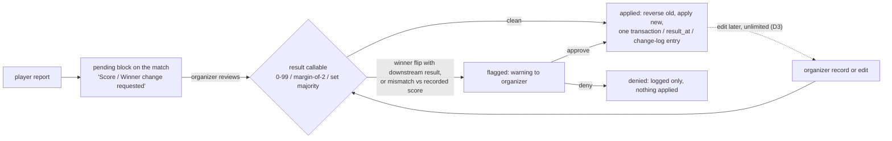

# Database Remodel Harmonization

|                |                                                                                                                                                                 |
| -------------- | --------------------------------------------------------------------------------------------------------------------------------------------------------------- |
| **Date**       | 2026-08-21 (revised 2026-08-22)                                                                                                                                 |
| **Scope**      | Corrections to the **Remodel Ledger** and **Remodel Review** only. Product decisions live in `DECISIONS_BRIEF.md`; branch conflicts in `DEV_ANUJ_CONFLICTS.md`. |
| **Rules**      | A field is stored only if the server cannot derive it (`points_spent` is the model case). One name per thing.                                                   |
| **Code links** | Permalinks to `dev-anuj` `3f40773`. Data facts from the full production export of 2026-08-15.                                                                   |

## 1. Decisions

| #                 | Decision                                                                                                                                                                                                                                                                                                                                                                             |
| ----------------- | ------------------------------------------------------------------------------------------------------------------------------------------------------------------------------------------------------------------------------------------------------------------------------------------------------------------------------------------------------------------------------------ |
| D1 | **No submissions collection.** Player reports are a pending block on the match doc; the `tournament` change log (actor, before/after) is the audit. The owner reads it through the CSV exporter (`tournament` added to `analysis/export-firestore.js`).                                                                                                                              |
| D2 | **Ladder challenges keep `event_id`.** The year-round ladder is an event; its manager confirms results (±3, loser floored at 0) through `challengeResults`.                                                                                                                                                                                                                          |
| D3 | **One-step rescore, unlimited.** Reverse old + apply new in one transaction; `result_at` stamped each time; `completed_at` pinned at first scoring; every edit logged.                                                                                                                                                                                                               |
| D4 | ~~**Nothing auto-applies.** A winner flip with a downstream result, or a mismatch against the recorded score, flags for the organizer; players see "Score / Winner change requested"; tick applies, X denies; approval never overwrites a played slot.~~ **SUPERSEDED 2026-08-23 — see the amendment below.** The one surviving clause: **approval never overwrites a played slot.** |
| D5 | **One server-side placer** on participant-create seats joiners within their zone's draws (open LOADING slot or RR group; zone-assigned at join before generation). Organizer-removed players stay in Unplaced; the placer never re-seats them.                                                                                                                                       |
| D6 | **Walkovers only.** No-show is removed. A walkover is all-zero scores plus a winner, tournaments only; `is_walkover` is not stored. **Payout:** a Round Robin group walkover pays **1 point to each player**; a knockout walkover advances the winner and the eliminated player collects that round's award.                                                                         |

### Amendment — 2026-08-23 · results auto-apply on submission

**Owner ruling. Replaces D4 and the review half of §2.** Authoritative text: `docs/PROJECT-PLAN.md` §2.

- A player submits a winner and a score. **It applies immediately** — no organizer approval step. Points paid, stats written, knockout winner advanced.
- **Both players are notified.** Winner: _"Win recorded — {score} v. {opponent}"_. Loser: _"Score recorded — {score} v. {opponent}"_.
- **Same winner, different scores** → the submission with the **smaller aggregate winning margin** is recorded, reverse-then-reapply in one transaction. Σ(winner's games) − Σ(loser's games); tie → first submission stands. Worked case: `7-0, 7-0` (margin 14) against `7-2, 7-4` (margin 8) → **`7-2, 7-4` records**.
- **Different winners** → nothing changes. **The first submitted result stays applied and displayed.** The match flags, both players see _"Result disputed — organizer reviewing"_, the organizer is notified once and resolves by rescore (D3).
- **Scope: all three** — tournament matches, ladder challenges (±3) and friendlies (+2/+1).
- **Walkovers stay organizer-only.** A player-submitted all-zero result is rejected.
- **L3 amended:** `score_pending` retires; the idempotency hash moves inside `result_submissions`, a map keyed by submitter uid carrying winner, sets, margin, timestamp and hash.
- **Unchanged:** validation (0–99, margin exactly 2 above 10, set majority, winner named), D3's unlimited organizer rescore, and the refusal to overwrite a played slot in the next round.

## 2. Scoring and review contract (Phase 4b)

Set scores are integers 0–99; when the higher score exceeds 10 the margin must be exactly 2; a walkover is all zeros; the winner takes the set majority. Every score field is server-written.

| Valid                                              | Invalid           |
| -------------------------------------------------- | ----------------- |
| 4-3, 7-2, 7-5, 8-4, 9-3, 10-4, 24-22, 38-40, 94-92 | 12-2, 40-0, 90-40 |

- **Walkover payout:** Round Robin group — 1 point each; knockout — winner advances, eliminated player collects the round award. A player who fails to appear for a scheduled match is **not** a walkover: the organizer records a real 6-0 result, paid normally.
- **Approving a change on a knockout match:** if the next match already holds a completed or submitted result the approval is refused with a message; otherwise the change is approved and the new winner replaces the player in the next match's slot.
- **Group bonus:** organizer toggle pays +5 to every member, reverses on toggle-off; the `rr_groupbonus` stamp is the receipt (pay only if unstamped, reverse only if stamped).
- **Ladder:** `challengeResults`, authorized by the ladder event's manager, same score rule, same pending → confirmed lifecycle.

## 3. Ledger amendments

| #                   | Amendment                                                                                                                                                                                                                                                                                                                                                                                                                                    | Collection                       |
| ------------------- | -------------------------------------------------------------------------------------------------------------------------------------------------------------------------------------------------------------------------------------------------------------------------------------------------------------------------------------------------------------------------------------------------------------------------------------------- | -------------------------------- |
| L1   | Challenges keep `event_id`; a permanent ladder event document exists. `league` still derives from `stats.league`.                                                                                                                                                                                                                                                                                                                            | `matches`                        |
| L2   | Add `result_at`.                                                                                                                                                                                                                                                                                                                                                                                                                             | `matches`                        |
| L3   | The idempotency hash lives inside `score_pending`; no separate `result_application` field.                                                                                                                                                                                                                                                                                                                                                   | `matches`                        |
| L4   | Add `organizer_ids` (per-event assignment; `providers` rows carry roles, not assignments).                                                                                                                                                                                                                                                                                                                                                   | `events`                         |
| L5   | Add `preferred_zone_manual` (live guard against court edits re-zoning a player).                                                                                                                                                                                                                                                                                                                                                             | `preferences`                    |
| L6   | `profile_details_visible` is **dropped** (owner ruling 2026-08-22): it hid only the league pill, which is public on the leaderboards.                                                                                                                                                                                                                                                                                                        | `users`                          |
| L7   | Both `zones` (coverage) and `zone_draw_config` (draw bucketing: `{ enabled, buckets: [{ id, label, zones[] }], includeUnassigned, merges }`) stay; every bucket zone must appear in `zones`.                                                                                                                                                                                                                                                 | `events`                         |
| L8   | `group_lessons` retires; a lesson is an add-on block on a social event.                                                                                                                                                                                                                                                                                                                                                                      | `events`                         |
| L9   | Public-field contract: every collection readable publicly except `contacts` **and `mailing_list`**; `preferences`, `tasks`, `site_stats` public; only `points_spent` stored, totals derived at read.                                                                                                                                                                                                                                         | all                              |
| L10 | Remove `no_show`; walkovers only (D6). The walkover **payout** differs by stage: Round Robin group 1 point each; knockout winner advances and the eliminated player collects the round award. A missed scheduled match is recorded as a real 6-0 result, not a walkover.                                                                                                                                                                     | `matches`                        |
| L11 | Bookings: `lead → in_progress → completed`, `cancelled` from `lead` only (points refunded); `completion_requested_at` while the player answers "Got your racquet back?"; no `flagged` / `cancel_requested`.                                                                                                                                                                                                                                  | `bookings`                       |
| L12 | Withdrawal: Withdraw button for members; after draws, unplayed matches become walkovers (RR 1 point each; knockout opponent advances); organizer Reset + orange ! form writes `status: withdrawn` + note; re-add allowed, walkovers corrected by rescore.                                                                                                                                                                                    | `event_participants` · `matches` |
| L13 | Contacts readable in-app only by the event organizer for their own sign-ups and by opponents through connections; super-admin profile viewing removed.                                                                                                                                                                                                                                                                                       | `contacts`                       |
| L14 | `pointswon` and `totalPointsPlayed` are **not stored**; "P/G Won %" is derived client-side from the member's matches.                                                                                                                                                                                                                                                                                                                        | `stats`                          |
| L15 | A per-event `zone` (organizer-set, marked manual) on the participant row; the profile zone is untouched. **`req_zone_change` / `new_zone` are kept** (owner ruling 2026-08-22): before matches are generated the player moves freely; after generation the organizer is notified and the player sits in **both** zone draws until the organizer resolves it — displace, add to both draws (default), or cancel. A zone change never unseats. | `event_participants`             |
| L16 | Add `available_to_play` (member toggle; off shows an Away pill on challenge and rally cards).                                                                                                                                                                                                                                                                                                                                                | `preferences`                    |
| L17 | Round deadlines are keyed by draw and round and **exclude the Round Robin group stage** (it runs the season); Round Robin knockout rounds carry deadlines.                                                                                                                                                                                                                                                                                   | `events`                         |
| L18 | Doubles without a partner: a player may register alone and joins a **partner pool** for that event; pool members are the dropdown other players pick from, and a pool member is notified when someone new joins. Selecting a partner removes both from the pool. A partner who is not on the app is stored as `partner_name` only.                                                                                                           | `event_participants`             |

## 4. Naming

| #                 | Resolution                                                                                     |
| ----------------- | ---------------------------------------------------------------------------------------------- |
| N1 | Catalog collection is **`services`**; `offers` retires. Correct the Review's Phase 6a wording. |
| N2 | Bonus stamp is **`rr_groupbonus`**. Correct the Review's Phase 4b structure row.               |

## 5. Sequencing corrections to the Review

| #                 | Correction                                                                                                                                                                      | Phase |
| ----------------- | ------------------------------------------------------------------------------------------------------------------------------------------------------------------------------- | ----- |
| S1 | The `loses` strip lands in Phase 4b, where both writers stop (result deltas, friendly payout).                                                                                  | 4b    |
| S2 | Add `tournamentResults.js` to the touched list — it writes `rr_winner_pts_v2`.                                                                                                  | 1     |
| S3 | The participant check reads `status`; no withdrawn data exists, so code only.                                                                                                   | 2a    |
| S4 | Events rename: `isCreatorOfEvent()` is stale — `creator_id` is read by `isManagerOfEvent` / `isOwnerOfEvent`, the events rules pins, `isEventOrganizer`, `onScheduleRequested`. | 2a    |
| S5 | No `requested_by` backfill (the boolean never recorded who asked); pending requests expire, players re-request.                                                                 | 3     |
| S6 | The `event_creator` fallback ends at the `providers` cutover, not at Lockdown.                                                                                                  | 5     |

Every phase deploys functions → rules → hosting with union whitelists; every hosting build carries the App Check key.

## 6. Where it lands

| Item          | Code                                                                                                                                                                                                                                                                                                   |
| ------------- | ------------------------------------------------------------------------------------------------------------------------------------------------------------------------------------------------------------------------------------------------------------------------------------------------------ |
| S1            | [`lib/tournamentResult.js#L136`](https://github.com/tbtctennis/Racquets-And-Strings/blob/3f40773/functions/lib/tournamentResult.js#L136) · [`friendlyPoints.js#L28-L29`](https://github.com/tbtctennis/Racquets-And-Strings/blob/3f40773/functions/friendlyPoints.js#L28-L29)                          |
| S2            | [`tournamentResults.js#L202`](https://github.com/tbtctennis/Racquets-And-Strings/blob/3f40773/functions/tournamentResults.js#L202)                                                                                                                                                                     |
| S3            | [`tournamentResults.js#L111`](https://github.com/tbtctennis/Racquets-And-Strings/blob/3f40773/functions/tournamentResults.js#L111)                                                                                                                                                                     |
| S4            | [`firestore.rules#L93-L107`](https://github.com/tbtctennis/Racquets-And-Strings/blob/3f40773/firestore.rules#L93-L107) · [`tournamentResults.js#L27`](https://github.com/tbtctennis/Racquets-And-Strings/blob/3f40773/functions/tournamentResults.js#L27) · `notifications.js` (`onScheduleRequested`) |
| L3            | [`tournamentResults.js#L96-L104`](https://github.com/tbtctennis/Racquets-And-Strings/blob/3f40773/functions/tournamentResults.js#L96-L104)                                                                                                                                                             |
| L4            | [`firestore.rules#L93-L100`](https://github.com/tbtctennis/Racquets-And-Strings/blob/3f40773/firestore.rules#L93-L100)                                                                                                                                                                                 |
| L5            | [`profileService.ts`](https://github.com/tbtctennis/Racquets-And-Strings/blob/3f40773/src/features/profile/services/profileService.ts) · [`useTournament.ts`](https://github.com/tbtctennis/Racquets-And-Strings/blob/3f40773/src/pages/tournament/useTournament.ts)                                   |
| L6 · L9 · L13 | [`firestore.rules#L183`](https://github.com/tbtctennis/Racquets-And-Strings/blob/3f40773/firestore.rules#L183) (contacts) · [`firestore.rules#L226`](https://github.com/tbtctennis/Racquets-And-Strings/blob/3f40773/firestore.rules#L226) (preferences → public)                                      |

## 7. Accepted trade-offs

| #                 | Trade-off                                                                       | Disposition                                                                                                                                                                                                                                 |
| ----------------- | ------------------------------------------------------------------------------- | ------------------------------------------------------------------------------------------------------------------------------------------------------------------------------------------------------------------------------------------- |
| R1 | Unlimited organizer edits re-open the tamper surface server scoring closed.     | Accepted — auditable via change log, pinned `completed_at`, `result_at`.                                                                                                                                                                    |
| R2 | No independent submissions record; the server that applies also writes the log. | Accepted — `reported_by` + logged payloads compensate.                                                                                                                                                                                      |
| R3 | One pending block per match: two conflicting reports cannot coexist.            | Overwrite-latest; the superseded report stays in the change log.                                                                                                                                                                            |
| R4 | D2 contradicts the Ledger's play section.                                       | Amend the Ledger before implementation.                                                                                                                                                                                                     |
| R5 | BYE / LOADING sentinels in `player_*_id`.                                       | Exclude sentinels from connections, stat deltas, notifications.                                                                                                                                                                             |
| R6 | Derived `loses` vs legacy drift.                                                | Verified clean: all 204 stats docs satisfy `loses = matchesPlayed − wins`. Counters are authoritative for pre-2026 history (all live match docs are 2026); reconciliation baselines from the archived counter snapshot, never from matches. |
| R7 | `preferences` world-readable again.                                             | Accepted — member choices only; role and provider fields move to `providers`.                                                                                                                                                               |

## Future works

- Organizer-assignment UI and audit trail over `organizer_ids` (after `providers`).
- Recompute-and-diff reconciliation tooling in the migrations framework.
- Runtime-editable courts map.
- Uniform null-filled schemas (deferred standard).
- Staging tier, backup policy details, mobile path — decisions deferred (see `DECISIONS_BRIEF.md`).
