# Workflow states and decision tables

|               |                                                                                                                                                                                                                    |
| ------------- | ------------------------------------------------------------------------------------------------------------------------------------------------------------------------------------------------------------------ |
| **Date**      | 2026-08-23 (rev 2 — target state folded in)                                                                                                                                                                        |
| **Reviewed**  | `tbtc/dev-anuj` @ `9c81f00`, against every decision in `docs/notes/` and `docs/sprints/`                                                                                                                           |
| **Method**    | **Now** is read from source and cited to a file. **Target** is read from the decision records and cited to its ruling. Where a decision document contradicts the code, the gap is named rather than smoothed over. |
| **Companion** | `PROJECT-PLAN.md` (who and when) · `FUTURE-WORK.md` (what is not scheduled) · this file (what the machine does, before and after)                                                                                  |

**Key:** ✅ built · ⚠️ built but wrong · ❌ absent · **[Sprint D1](../../../sprints/d1-d5/SPRINT-D1.md)–[D5](HARMONIZATION_REPORT.md#D5)** = the sprint that changes it.

---

## 0 · The data deltas, in one table

Every stored-field change decided across the notes. This is the spine — most workflow changes below are a consequence of one of these rows.

| Collection           | Field                                         | Change                                                                                                             | Ruling                                                                  | Sprint                               |
| -------------------- | --------------------------------------------- | ------------------------------------------------------------------------------------------------------------------ | ----------------------------------------------------------------------- | ------------------------------------ |
| `matches`            | `result_at`                                   | **add** — re-stamped on every apply                                                                                | [L2](HARMONIZATION_REPORT.md#L2)                                        | [Sprint D2](../../../sprints/d1-d5/SPRINT-D2.md) |
| `matches`            | `completed_at`                                | **pin at first scoring**, never rewritten                                                                          | [D3](HARMONIZATION_REPORT.md#D3)                                        | Sprint D2                            |
| `matches`            | `result_application`                          | **retire** → hash moves inside `result_submissions`                                                                | [L3](HARMONIZATION_REPORT.md#L3) + amendment                            | Sprint D2                            |
| `matches`            | `result_submissions`                          | **add** — map keyed by submitter uid: winner, sets, margin, submitted_at, hash                                     | amendment                                                               | Sprint D2                            |
| `matches`            | `score_pending`                               | **retire** — never shipped; superseded before it existed                                                           | amendment                                                               | Sprint D2                            |
| `matches`            | `score_disputed`, `score_disputed_at`         | **add** — set only when two submissions name different winners                                                     | amendment                                                               | Sprint D2                            |
| `matches`            | `no_show`                                     | **remove**                                                                                                         | [D6](HARMONIZATION_REPORT.md#D6) · [L10](HARMONIZATION_REPORT.md#L10)   | Sprint D2                            |
| `matches`            | `walkover` / `is_walkover`                    | **two names today.** Decide: derive from all-zero + winner, or keep one name                                       | D6 (says not stored)                                                    | Sprint D2                            |
| `matches`            | `rr_group_bonus_v2`                           | **rename** → `rr_groupbonus`                                                                                       | [N2](HARMONIZATION_REPORT.md#N2)                                        | Sprint D2                            |
| `matches`            | `claimed_winner_*`, `score_line`              | **strip** — after functions _and_ hosting are out                                                                  | conflicts §Dropped                                                      | [Sprint D5](../../../sprints/d1-d5/SPRINT-D5.md) |
| `events`             | `organizer_ids`                               | **add** — per-event assignment                                                                                     | [L4](HARMONIZATION_REPORT.md#L4)                                        | Sprint D2                            |
| `events`             | `zone_draw_config`                            | **persist** `{enabled, buckets[], includeUnassigned, merges}`; every bucket zone must appear in `zones`            | [L7](HARMONIZATION_REPORT.md#L7)                                        | [Sprint D4](../../../sprints/d1-d5/SPRINT-D4.md) |
| `events`             | round deadlines                               | **add**, keyed by draw **and** round; **exclude the RR group stage**                                               | [L17](HARMONIZATION_REPORT.md#L17)                                      | Sprint D4                            |
| `events`             | `group_lessons`                               | **retire** the collection — a lesson becomes an add-on block on a social event                                     | [L8](HARMONIZATION_REPORT.md#L8) · [PD2](DECISIONS_BRIEF.md#PD2)        | Sprint D5                            |
| `events/ladder`      | —                                             | **fixed doc id** for the permanent ladder event                                                                    | [L1](HARMONIZATION_REPORT.md#L1) · [LB-44](../ACTION-REPORT.md#LB-44)   | Sprint D4                            |
| `event_participants` | `status`                                      | **add** `active \| withdrawn` + reason/note/at/by; replaces the `removal` flag **and** the RR withdrawn list       | [L12](HARMONIZATION_REPORT.md#L12)                                      | Sprint D4                            |
| `event_participants` | `zone`                                        | **add** — per-event, organizer-set, marked manual. Profile zone untouched                                          | [L15](HARMONIZATION_REPORT.md#L15)                                      | Sprint D4                            |
| `event_participants` | `req_zone_change`, `new_zone`                 | **kept** (owner ruling). Legacy `zone_change_requested*` read-only                                                 | L15                                                                     | Sprint D4                            |
| `event_participants` | `partner_uid` / `partner_name` / partner pool | **add** — register alone → pool; pool is the dropdown; selecting removes both                                      | [L18](HARMONIZATION_REPORT.md#L18)                                      | Sprint D4                            |
| `event_participants` | `skill`                                       | **join-time snapshot only the organizer changes**                                                                  | WDR §6 · [F9](WORKFLOW_DESIGN_REPORT.md#F9)                             | Sprint D4                            |
| `preferences`        | `preferred_zone_manual`                       | **add** — guard against a court edit silently re-zoning a player                                                   | [L5](HARMONIZATION_REPORT.md#L5)                                        | Sprint D4                            |
| `preferences`        | `available_to_play`                           | **add** — off shows an Away pill                                                                                   | [L16](HARMONIZATION_REPORT.md#L16)                                      | Sprint D4                            |
| `preferences`        | role / provider fields                        | **move out** → `providers`                                                                                         | [R7](HARMONIZATION_REPORT.md#R7) · [PD6](DECISIONS_BRIEF.md#PD6)        | Sprint D5                            |
| `preferences`        | read                                          | **becomes public**                                                                                                 | [L9](HARMONIZATION_REPORT.md#L9) · [PD1](DECISIONS_BRIEF.md#PD1) · R7   | Sprint D2                            |
| `users`              | `profile_details_visible`                     | **drop** — hid only the league pill, which is public anyway                                                        | [L6](HARMONIZATION_REPORT.md#L6)                                        | Sprint D4                            |
| `stats`              | `pointswon`, `totalPointsPlayed`              | **not stored** — P/G Won % derived from the member's matches                                                       | [L14](HARMONIZATION_REPORT.md#L14)                                      | **Sprint D2/D3 — see F-C**           |
| `stats`              | `loses`                                       | **not stored** — derived as `matchesPlayed − wins`. **Both writers stop**: result deltas _and_ friendly payout     | [S1](HARMONIZATION_REPORT.md#S1)                                        | [Sprint D3](../../../sprints/d1-d5/SPRINT-D3.md) |
| `stats`              | `rankPosition`, `tournamentsPlayed`           | **delete** — written, rendered nowhere                                                                             | [DC-11](../ACTION-REPORT.md#DC-11) · [DC-12](../ACTION-REPORT.md#DC-12) | Sprint D3                            |
| `contacts`           | read                                          | organizer (own sign-ups) **added**, super-admin **removed**                                                        | [L13](HARMONIZATION_REPORT.md#L13)                                      | Sprint D2                            |
| `bookings`           | status set                                    | `lead → in_progress → completed` + `cancelled` from `lead`; `completion_requested_at` is a **stamp, not a status** | [L11](HARMONIZATION_REPORT.md#L11)                                      | Sprint D5                            |
| `offers`             | —                                             | **retire** → `services`, edited through an owner-gated callable                                                    | [N1](HARMONIZATION_REPORT.md#N1)                                        | Sprint D5                            |
| `redemption_locks`   | —                                             | **remove**                                                                                                         | WDR §8                                                                  | Sprint D5                            |
| `providers`          | —                                             | **new** — roles, **not** assignments                                                                               | R7 · [PD4](DECISIONS_BRIEF.md#PD4)                                      | Sprint D5                            |
| `awards`             | —                                             | one document per award with the winners' receipt                                                                   | [PD10](DECISIONS_BRIEF.md#PD10)                                         | Sprint D5                            |
| all                  | balances                                      | **only `points_spent` stored**; totals and balances derived at read                                                | L9 · PD1                                                                | Sprint D5                            |
| all                  | scheduling dates/times                        | **nothing stored.** Date-bearing indexes retire                                                                    | WDR §3                                                                  | Sprint D4                            |

---

## 1 · Tournament result

### 1.1 Now — organizer-only, one shot, terminal

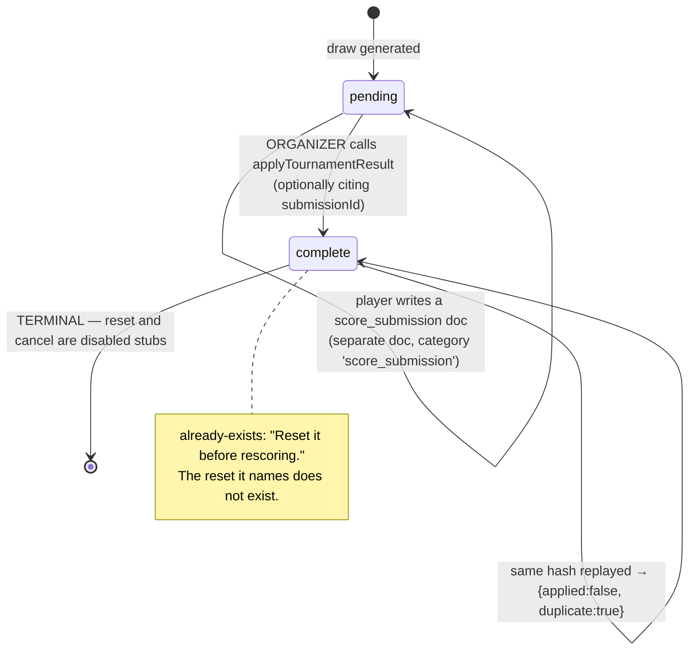

| Caller                                   | Now                    | Source                                    |
| ---------------------------------------- | ---------------------- | ----------------------------------------- |
| `creator_id` or a uid in `organizer_ids` | ✅                     | `tournamentResults.js` `isEventOrganizer` |
| **Either player**                        | ❌ `permission-denied` | same                                      |

### 1.2 Target — auto-apply, reconcile, dispute

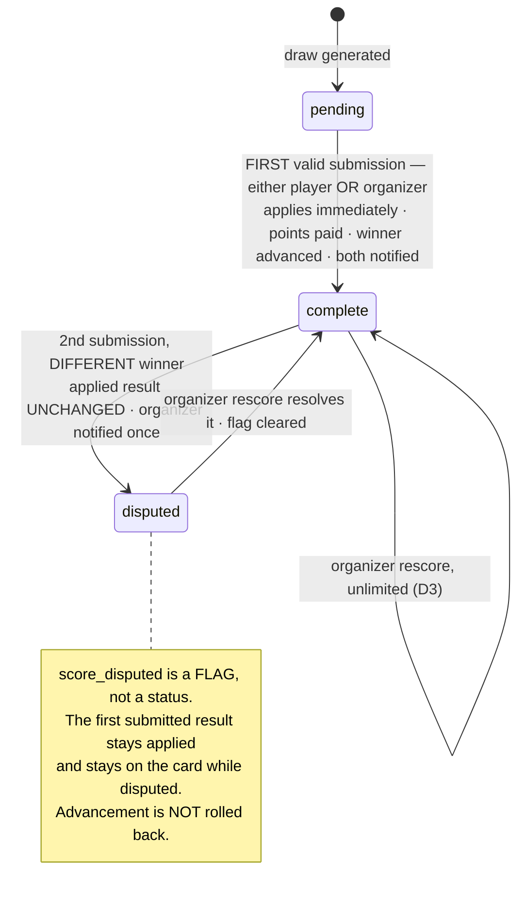

**Incoming-submission decision table** — evaluate in order, first match wins.

| #   | Condition                                                                                | Action                                                                | Notifies        |
| --- | ---------------------------------------------------------------------------------------- | --------------------------------------------------------------------- | --------------- |
| 1   | Submitter is not one of the two participants (or a doubles captain) and not an organizer | **reject**                                                            | —               |
| 2   | All-zero scores **and** submitter is a player                                            | **reject** — walkovers are organizer-only                             | —               |
| 3   | Fails validation (§2)                                                                    | **reject**                                                            | —               |
| 4   | No applied result yet                                                                    | **apply**: pay, write stats, advance winner                           | both players    |
| 5   | Hash identical to the applied result                                                     | **no-op**                                                             | —               |
| 6   | Same winner, incoming margin **<** applied margin                                        | **reverse + reapply** in one transaction                              | both players    |
| 7   | Same winner, incoming margin **≥** applied margin                                        | record in `result_submissions`, applied result untouched              | —               |
| 8   | Same winner, margins **equal**                                                           | first submission stands                                               | —               |
| 9   | **Different winner**                                                                     | set `score_disputed`, applied result untouched, advancement untouched | organizer, once |

**Margin** = Σ(winner's games) − Σ(loser's games) across all sets.

**Worked case.** QF, Chandra beat Rahul. Chandra submits `7-0, 7-0` → margin **14**, applied, Chandra → SF, Rahul banks **QF = 3**. Rahul submits `7-2, 7-4` → margin **8**. `8 < 14`, so **`7-2, 7-4` records**.

> **Finding F-M — after [L14](HARMONIZATION_REPORT.md#L14) and [S1](HARMONIZATION_REPORT.md#S1), a same-winner reconcile has no stat consequences at all.** Once `pointswon`, `totalPointsPlayed` and `loses` stop being stored, every remaining stat delta (`matchesPlayed`, `wins`, `leaguePoints26`, `league`) depends only on **winner + round + format** — never on games. So row 6's "reverse + reapply" is a **pure score-field update**; the stat reversal is a no-op. The full reverse-then-reapply is only genuinely needed when **the winner changes**. Worth knowing before anyone builds the expensive path for the common case.

**Guards that survive from [D4](HARMONIZATION_REPORT.md#D4):** a winner flip is **refused with a message** when the next match already holds a completed or submitted result. Approval never overwrites a played slot.

### 1.3 Entry guards — now

Evaluated in order; first failure throws.

| #     | Guard                                                                                                                 | Failure                                              |
| ----- | --------------------------------------------------------------------------------------------------------------------- | ---------------------------------------------------- |
| 1–3   | Authenticated · `matchId` ≤500 chars · match exists                                                                   | `unauthenticated` / `invalid-argument` / `not-found` |
| 4     | `event_id` set, `category ∈ {singles,doubles}`, `tournament_choice ∈ {Singles,Doubles}`                               | `invalid-argument`                                   |
| 5–6   | Event exists · caller is an organizer                                                                                 | `not-found` / `permission-denied`                    |
| 7     | Both player uids set and distinct                                                                                     | `failed-precondition`                                |
| 8     | Result normalizes (§2)                                                                                                | `invalid-argument`                                   |
| 9     | Hash ≠ stored hash                                                                                                    | _returns duplicate, not an error_                    |
| 10    | `status !== 'complete'` **and** no `result_application`                                                               | `already-exists`                                     |
| 11    | `status === 'pending'`                                                                                                | `failed-precondition`                                |
| 12    | Both players are participants with **`removal !== true`**                                                             | `failed-precondition`                                |
| 13    | If `submissionId`: right category/event/match, unresolved, submitter is a player, and `submissionMatchesResult` exact | `failed-precondition`                                |
| 14–16 | Advancement target exists in the same draw · not already `complete` · slot empty or already this winner               | `failed-precondition`                                |

Guard 12 becomes `status !== 'withdrawn'` in [Sprint D4](../../../sprints/d1-d5/SPRINT-D4.md) — see **F-B**.

### 1.4 Advancement — unchanged by the remodel

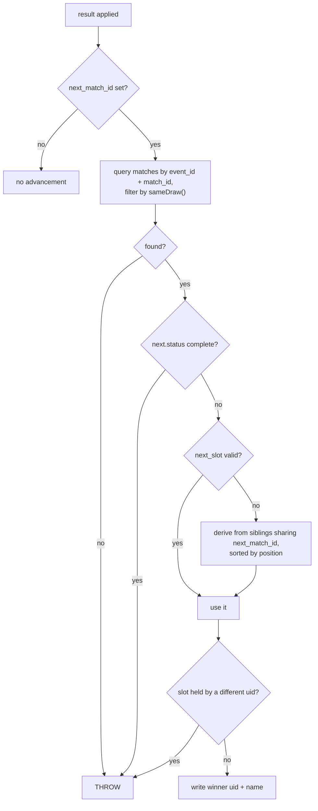

`sameDraw` compares `bracket ?? null`, `tournament_choice`, `division`, `skill_group`, **`zone ?? null`**. ✅ The zone normalization is present — template match ids repeat across zone draws, and without it a winner lands in the wrong zone's slot.

---

## 2 · Score validation

| #   | Rule                                     | Callable | Rules              | Form            | Target                          |
| --- | ---------------------------------------- | -------- | ------------------ | --------------- | ------------------------------- |
| 1   | Integers, 0–99                           | ✅       | ❌ caps at **0–7** | ⚠️ caps at 30   | all three at 0–99               |
| 2   | **Higher score > 10 ⇒ margin exactly 2** | ❌       | ❌                 | ❌              | **all three**                   |
| 3   | Winner takes the set majority            | ✅       | ❌                 | ❌              | all three                       |
| 4   | Winner is one of the participants        | ✅       | —                  | ✅              | unchanged                       |
| 5   | Walkover ⇒ all zero                      | ✅       | —                  | auto-derived ⚠️ | explicit switch, organizer-only |
| 6   | All-zero and not flagged ⇒ reject        | ✅       | —                  | —               | unchanged                       |
| 7   | No-show only in RR group                 | ✅       | —                  | ✅              | **rule deleted with `no_show`** |
| 8   | Court name ≤ 200 chars                   | ✅       | —                  | —               | unchanged                       |

The twelve contract examples: **valid** `4-3` `7-2` `7-5` `8-4` `9-3` `10-4` `24-22` `38-40` `94-92` · **invalid** `12-2` `40-0` `90-40`.

> **F-E.** The set-majority half is built. The **margin-of-2 rule exists in no layer** — `12-2` and `90-40` pass the callable today. Meanwhile the rules cap player submissions at 0–7, so `8-4` and `24-22` are rejected at the boundary while passing at the callable. Three layers, three answers.

### The [LB-1](../ACTION-REPORT.md#LB-1) chain, traced

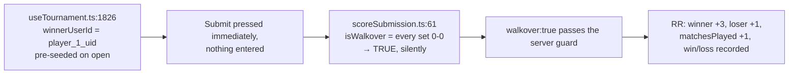

> **F-H.** The server _would_ have caught this — it rejects an all-zero result that is **not** flagged as a walkover. The client is the only reason it is reachable: it derives the flag automatically. Fixing the seed closes it; an explicit organizer-only Walkover switch closes it permanently.

---

## 3 · Points

### 3.1 Payout — now and target

| Match                  |      Winner |          Loser | Winner paid?       | Change                     |
| ---------------------- | ----------: | -------------: | ------------------ | -------------------------- |
| RR group, **played**   |       **3** |          **1** | ✅ immediately     | unchanged                  |
| RR group, **walkover** |        ⚠️ 3 |           ⚠️ 1 | ✅                 | → **1 / 1**, both players  |
| RR group, no-show      |           1 |              1 | ✅ both            | **rule deleted**           |
| Knockout R32           |          20 |          **1** | ❌ banked          | unchanged                  |
| Knockout R16           |          20 |          **2** | ❌                 | unchanged                  |
| Knockout QF            |          20 |          **3** | ❌                 | unchanged                  |
| Knockout SF            |          20 |          **5** | ❌                 | unchanged                  |
| Knockout **F**         |      **20** |         **10** | ✅ `isFinal`       | unchanged                  |
| Knockout walkover      | advances, 0 |    round award | ❌                 | unchanged                  |
| Ladder challenge       |      **+3** | **−3** floor 0 | ✅                 | moves to a callable        |
| Friendly / rally       |      **+2** |         **+1** | ✅                 | unchanged                  |
| RR group bonus         |     +5 each |        +5 each | ❌ **stub throws** | → `setGroupBonus` callable |

`winnerPointsApply = rr || isFinal` — **a knockout winner scores only by taking the final.** Losing in the QF banks 3, and that is the player's entire return from the knockout.

**Target `matchAward` decision table:**

| #   | Condition                                     |   Winner |                        Loser |
| --- | --------------------------------------------- | -------: | ---------------------------: |
| 1   | `format='rr'` && `round='RR'` && **walkover** |        1 |                            1 |
| 2   | `format='rr'` && `round='RR'`                 |        3 |                            1 |
| 3   | `round='F'`                                   |       20 |                           10 |
| 4   | any other knockout round                      | 0 banked | `{R32:1, R16:2, QF:3, SF:5}` |

`matchAward` and `computeGroupStandings` must carry this identically and **change in one commit** — they have already drifted once, and the group table paid a phantom +5 nobody had received.

### 3.2 Stat fields per result — now vs target

| Field               | Winner now             | Loser now        | Target                                                                                         |
| ------------------- | ---------------------- | ---------------- | ---------------------------------------------------------------------------------------------- |
| `matchesPlayed`     | +1                     | +1               | unchanged                                                                                      |
| `wins`              | +1                     | —                | unchanged                                                                                      |
| `loses`             | —                      | +1               | **derived** — `matchesPlayed − wins`; **both writers stop** ([S1](HARMONIZATION_REPORT.md#S1)) |
| `leaguePoints26`    | if `winnerPointsApply` | always           | unchanged                                                                                      |
| `tournamentsPlayed` | only if `isFinal`      | ⚠️ **always +1** | **deleted** ([DC-12](../ACTION-REPORT.md#DC-12))                                               |
| `pointswon`         | own games              | own games        | **not stored** ([L14](HARMONIZATION_REPORT.md#L14))                                            |
| `totalPointsPlayed` | all games              | all games        | **not stored** (L14)                                                                           |
| `league`            | set                    | set              | unchanged                                                                                      |

> **F-D.** `tournamentsPlayed` increments on **every loss** — the loser branch adds it unconditionally, the winner only on the final. Five losses reads as "5 tournaments played". DC-12 deletes it, but nobody recorded that the stored value is actively wrong.

> **F-C — this is the one that moves a sprint.** `pointswon` and `totalPointsPlayed` are written **by the server on every result**, not only at bootstrap. The strip migration must run **after** the writer stops, or the next scored match re-creates them. **[Sprint D1](../../../sprints/d1-d5/SPRINT-D1.md)'s L14 scoping is incomplete — it belongs with the result path in [D2](HARMONIZATION_REPORT.md#D2)/D3.** Same shape for `loses` under S1: two writers (result deltas and friendly payout) must stop together.

### 3.3 Balances

`L9`/`PD1`: **only `points_spent` is stored.** Totals and balances are derived at read. Anything currently persisting a balance is a candidate for deletion in [Sprint D5](../../../sprints/d1-d5/SPRINT-D5.md).

---

## 4 · Join and slot allocation

### 4.1 Now — `slotStatus` gates the join

| #     | Condition                                                  | Outcome                                                       |
| ----- | ---------------------------------------------------------- | ------------------------------------------------------------- |
| 1     | Not a tournament, no division, or **no matches generated** | `null` — register freely                                      |
| 2     | `tournament_format === 'rr'` or any RR match               | **`null` — RR bypasses the gate entirely**                    |
| 3     | Singles + seniors                                          | slot in `Retired Pro` → `available` else `full`               |
| 4     | Singles, merged draw (`skill_group === 'All'`)             | slot in `All` → `available` else `full`                       |
| 5     | Singles, skill ≥ 4                                         | intended `Masters`, alternate `Challengers`                   |
| 6     | Singles, skill < 4                                         | intended `Challengers`, alternate `Masters`                   |
| 7     | Slot free in the intended group                            | `available`                                                   |
| 8     | Slot free in the **alternate** group                       | ⚠️ **`fallback`** — sets `skillOverride` to **4 or 3**        |
| 9     | Neither                                                    | **`full`** — join refused                                     |
| 10–11 | Doubles                                                    | consolidated `Doubles/All/All`, else `Doubles/{division}/All` |

Open slot = `player_N_name` is `PLAYER_LOADING` or `BYE`. Zone filter: `if (myZone && (m.zone ?? undefined) !== myZone) continue`.

> **F-I — the fallback rewrites the player's skill.** Row 8 returns `skillOverride: altGroup === 'Masters' ? 4 : 3`. **A player's recorded skill changes because of which slot happened to be free.** Same class as [LB-17](../ACTION-REPORT.md#LB-17), and the strongest argument for skill-as-a-join-time-snapshot.

### 4.2 Target — joining always registers

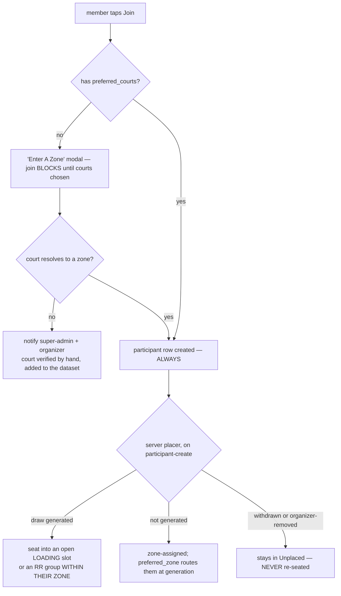

**No "draw is full" refusal. No fallback prompt. No skill rewrite.** Groups stay capped at 5 (`RR_GROUP_MAX`); `overGroupCap` guards every manual path. The in-browser late-join placer is **deleted** — two auto-placers used to fight over this and a player's group depended on whether an organizer had a browser tab open.

---

## 5 · Zone change _(new — [L15](HARMONIZATION_REPORT.md#L15))_

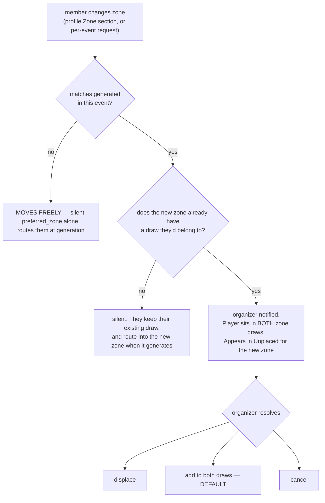

**A zone change never unseats anyone.** Existing matches are untouched — the player keeps playing every one of them. This is why `unplacedParticipants` tests seating **per draw**, not per event: a zone-changer is seated in their old draw and unseated in the new one, and only the second fact matters.

An explicit pick sets **`preferred_zone_manual`**, which stops a later court edit silently recomputing `preferred_zone` and moving them between draws.

**Two zone paths, deliberately different:** the tournament page's "Request Zone Change" is per-event and _notify-only_; the profile card's Zone section writes `preferences.preferred_zone` directly with no organizer in the loop.

Needs `firebase deploy --only functions:onZoneChanged`.

---

## 6 · Doubles partner _(new — [L18](HARMONIZATION_REPORT.md#L18))_

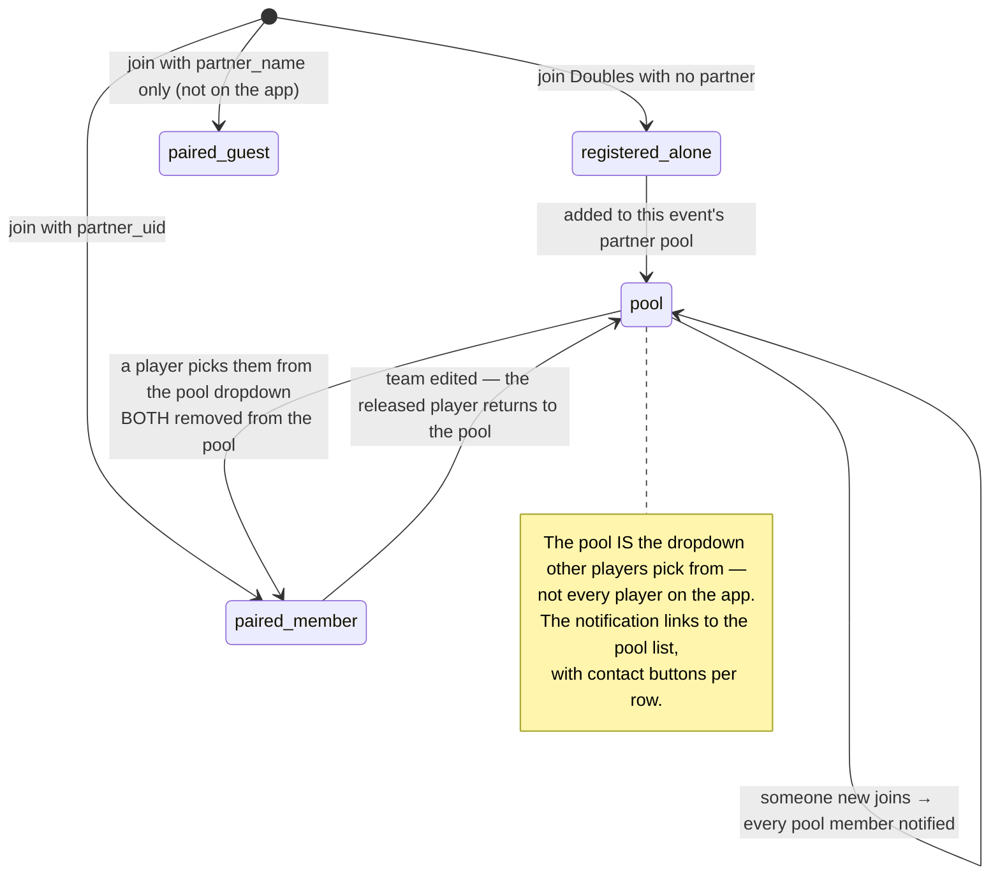

One `setDoublesPartner` writes either shape. For a member partner the **server creates their own participant row**, and partner uids sit on the match doc — so a partner on the app can read the opponents' contacts and submit scores. A guest partner has no uid and gets none of that.

---

## 7 · Ladder challenge

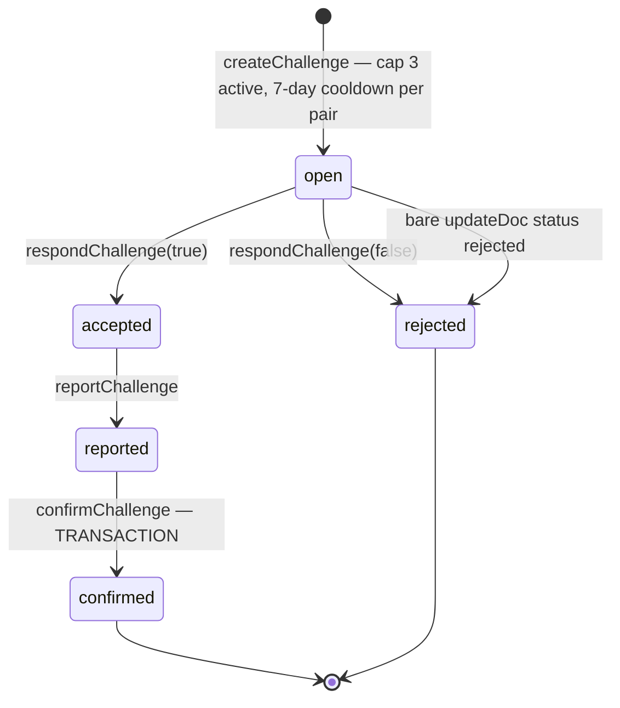

| Guard                | Value                                                                           |
| -------------------- | ------------------------------------------------------------------------------- |
| Active challenge cap | **3**                                                                           |
| Cooldown per pair    | **7 days**                                                                      |
| Points               | **±3**, loser floored at 0                                                      |
| Idempotency          | `applied === true \|\| status === 'confirmed'` read **inside** `runTransaction` |

✅ The floor needs a read-then-write, and it is correctly a transaction — in a plain batch two concurrent confirms both read the same starting value and one −3 is silently lost.
⚠️ But `confirmChallenge` **writes stats from the client**, which the branch's own rules deny — so **every confirm fails today**.

**Target ([Sprint D2](../../../sprints/d1-d5/SPRINT-D2.md)):** a `challengeResults` callable, authorized by the **ladder event's manager**, and the auto-apply rule applies here too — a reported challenge applies on submission, with the same margin reconcile and dispute flag. Challenges keep `event_id`; `events/ladder` is a permanent document.

> **F-L.** `rejected` has two writers with no shared guard.

---

## 8 · Friendly / rally

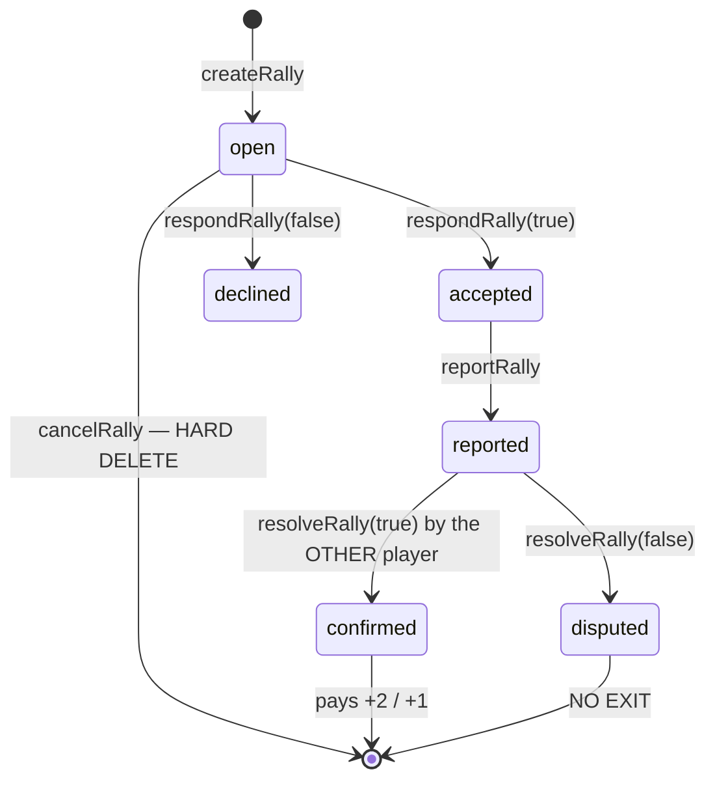

The payout trigger requires **all** of: category `rally` both sides · `reported → confirmed` · `event_id` and both uids unchanged · `reported_by` set · `confirmed_by` set, **different from `reported_by`**, and one of the two players · scores integers **0–7** · winner is a player.

> **F-K — `disputed` is a dead end.** Nothing transitions out, and no organizer path resolves it. A disputed rally is stuck with no points and no route forward. **The auto-apply ruling covers friendlies**, so [Sprint D2](../../../sprints/d1-d5/SPRINT-D2.md) should replace this state with the dispute flag + organizer rescore that tournaments get — otherwise the app keeps two different answers to the same question.

> **Note.** `cancelRally` **deletes the document**. Every other workflow transitions a status, and `D1` treats the change log as the audit. A deleted rally leaves no trace.

---

## 9 · RR group bonus _(new — [conflict 4](DEV_ANUJ_CONFLICTS.md#4-round-robin-group-bonus--broken))_

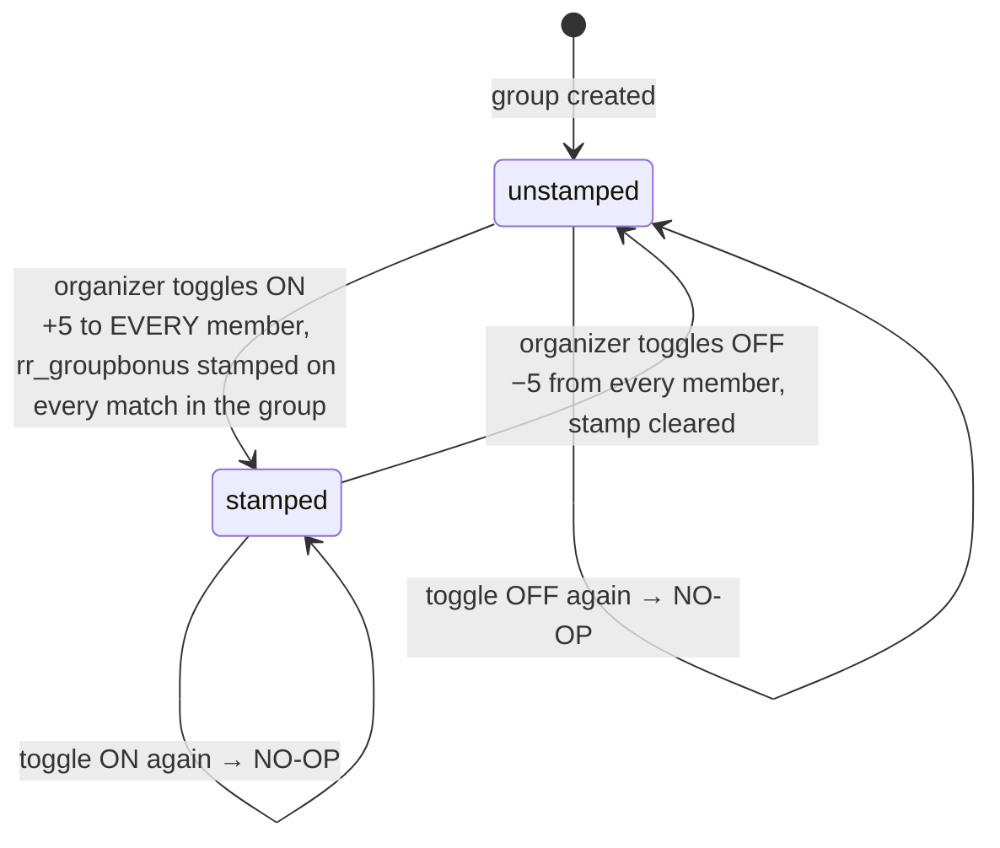

| Rule                                           | Why                                                                                                                                                                                                                                                             |
| ---------------------------------------------- | --------------------------------------------------------------------------------------------------------------------------------------------------------------------------------------------------------------------------------------------------------------- |
| The stamp **is** the receipt                   | It is the only proof of payment                                                                                                                                                                                                                                 |
| Pay only if unstamped; reverse only if stamped | It used to pay automatically when the last match completed, keyed off `status !== 'complete'` — which only means _this_ match was unscored. A corrected match re-confirmed paid a **second** +5 while a later reset removed only 5, leaving a permanent surplus |
| Reversal must **not** gate on completeness     | The organizer may award a group with unplayed matches (with a confirm warning)                                                                                                                                                                                  |
| Amount                                         | One `RR_GROUP_BONUS` constant, shared by payout and reversal                                                                                                                                                                                                    |

Today `handleSetGroupBonus` is a **stub that throws**. Target: a `setGroupBonus` callable with a manager check, stamping and paying in one transaction.

---

## 10 · Participant lifecycle

### 10.1 Now — two vocabularies

| Check               | Field read                                             | Where                  |
| ------------------- | ------------------------------------------------------ | ---------------------- |
| Result callable     | `participant.removal !== true`                         | `tournamentResults.js` |
| Connections trigger | `!['withdrawn','removed','inactive'].includes(status)` | `connections.js:103`   |

> **F-B.** Two independent definitions of "active". **A participant marked `status: 'withdrawn'` is still scoreable by the result callable.** `S3` names only one call site — both must change or [Sprint D4](../../../sprints/d1-d5/SPRINT-D4.md) fixes half the problem.

### 10.2 Target — one `status`, and walkovers on withdrawal

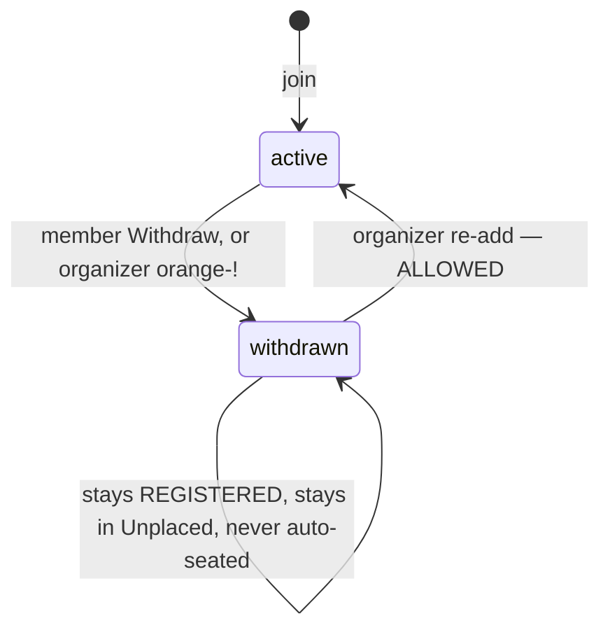

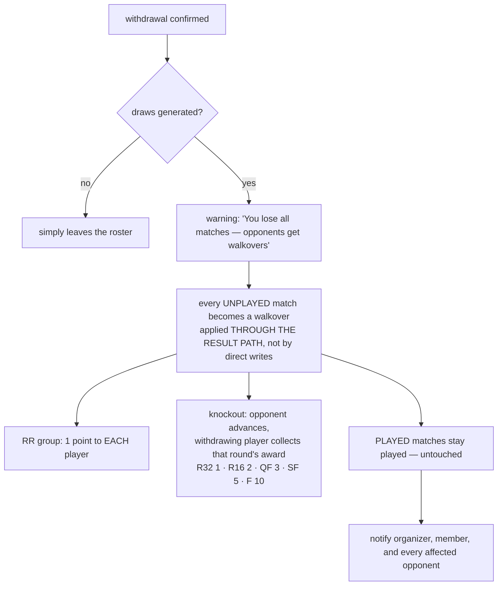

**Permanent from the member's side.** Re-add is allowed, but **applied walkovers are not auto-reversed** — the organizer corrects each by a normal rescore.

One `status` field replaces the removal flag, the RR withdrawn list **and** both active checks above.

> The old removal path purged the player from the **whole event** and deregistered them, and the withdrawn-list update had to ride the **same batch** as the match-doc changes — written separately, the matches change reached `onSnapshot` first and the just-removed player was re-seated, persisting across a reload. The `status` field removes the need for that choreography entirely.

---

## 11 · Contact access

| Reader                            | Now | Target                                                                                                                                    |
| --------------------------------- | --- | ----------------------------------------------------------------------------------------------------------------------------------------- |
| Owner                             | ✅  | ✅                                                                                                                                        |
| Holder of a **connection**        | ✅  | ✅                                                                                                                                        |
| **Current group-lesson coach**    | ✅  | **retires with `group_lessons`** ([L8](HARMONIZATION_REPORT.md#L8) · [PD2](DECISIONS_BRIEF.md#PD2), [Sprint D5](../../../sprints/d1-d5/SPRINT-D5.md)) |
| **Super-admin**                   | ✅  | ❌ **removed** ([L13](HARMONIZATION_REPORT.md#L13), [Sprint D2](../../../sprints/d1-d5/SPRINT-D2.md)) — the owner's access is the database export     |
| **Event organizer**, own sign-ups | ❌  | ✅ **added** via `onParticipantJoin` ([conflict 5](DEV_ANUJ_CONFLICTS.md#5-organizer-contact-access--gap), Sprint D2)                     |
| Anyone else                       | ❌  | ❌                                                                                                                                        |

Writes: owner only, whitelisted through `ownerContactFields()` with `hasOnly()`. Delete is `if false`.

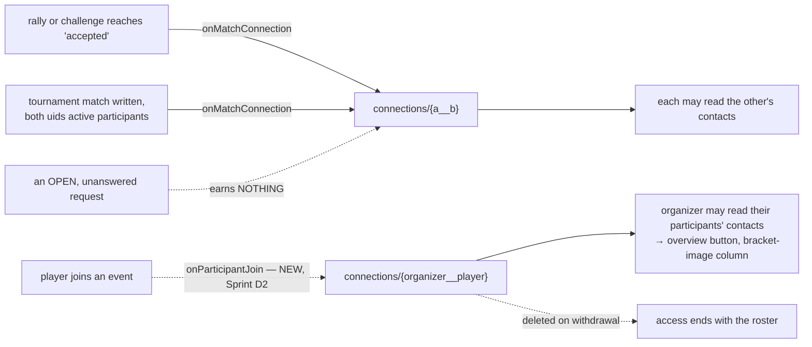

**An open request earns nothing** — otherwise anyone could harvest a phone number by firing off a challenge nobody answers.

`pairId = (a,b) => a < b ? a__b : b__a` exists in **both** `connections.js:34` and `firestore.rules` and must stay byte-identical, or every contact read in the app starts failing.

> **Consequence for all client code: a denied `contacts` read is normal, not an error.** The connection document lands a moment _after_ a request is accepted. `.catch()` each read individually — a batched `Promise.all` turns one expected denial into zero contacts on the page. _([LB-3](../ACTION-REPORT.md#LB-3), [LB-4](../ACTION-REPORT.md#LB-4).)_

> **F-J.** `isCurrentGroupLessonCoachFor` is a **fourth** reader that `DEV_ANUJ_CONFLICTS` §5 omits — it describes the rule as "owner / connection / super-admin". It retires in Sprint D5, so the contacts rule has a cross-sprint dependency: remove the predicate in the same change or it dangles.

`public_contacts` is maintained by `onContactProjection` as a **field projection**, not the marker the docs describe.

---

## 12 · Task claims

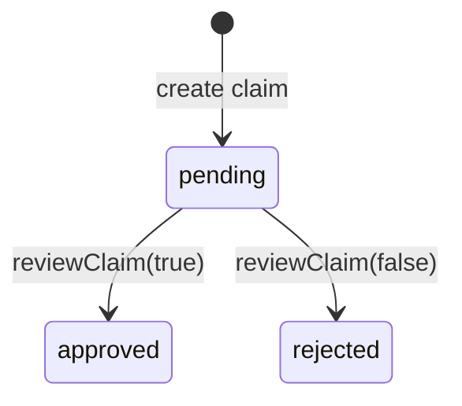

| Type         | Precondition              | Id                              | Target ([Sprint D5](../../../sprints/d1-d5/SPRINT-D5.md))               |
| ------------ | ------------------------- | ------------------------------- | ----------------------------------------------------------- |
| `volunteer`  | —                         | generated ⚠️                    | approved by the **event's** organizer; **deterministic id** |
| `host`       | —                         | generated ⚠️                    | same                                                        |
| `ambassador` | invitee `hasPlayedAMatch` | **`ambassador_{inviteeId}`** ✅ | **auto-approve**                                            |

Ambassador already has the deterministic id that makes a repeat a no-op. Volunteer and host do not.

---

## 13 · Round Robin groups and the knockout

### 13.1 Group formation — `buildZoneTierGroups`

| #   | Condition                                                                 | Outcome                                           |
| --- | ------------------------------------------------------------------------- | ------------------------------------------------- |
| 1   | Draw has **≤ 5 players**                                                  | **one group**; zone and band ignored              |
| 2   | Otherwise                                                                 | bucket by skill band, then preferred-court zone   |
| 3   | Lone player in a distinct zone, and **> 3** zone-clustered groups already | own placeholder group                             |
| 4   | Lone player in a distinct zone, otherwise                                 | pooled with the band, ordered by zone, then split |
| 5   | Each bucket                                                               | `splitEvenly(n)` — `g = ceil(n/5)`, groups of 3–5 |

`splitEvenly`: 5→[5] · 6→[3,3] · 7→[4,3] · 8→[4,4] · 9→[5,4] · 10→[5,5] · 11→[4,4,3] · 12→[4,4,4].
Bands: Beginners 2–2.5 · Challengers 3–3.5 · Masters 4–5. **The size algorithm is authoritative and is never overridden by band boundaries.**

### 13.2 Knockout gate — `rrKnockoutReady`

```js
rrGroupMatches.length > 0 && rrGroupMatches.every((m) => m.status === 'complete') && rrKnockoutMatches.length === 0;
```

⚠️ **No placeholder exclusion.** A one-player group legitimately keeps a placeholder match so the lone player stays visible and movable — that placeholder is never `complete`, so **the gate is pinned shut forever**, with no message and no way to clear it. _([LB-2](../ACTION-REPORT.md#LB-2), [Sprint D1](../../../sprints/d1-d5/SPRINT-D1.md): add `m.player_1_uid && m.player_2_uid`.)_

### 13.3 Seeding and the size bar

|                  | Now                                                                                                 | Target ([R-4](../ACTION-REPORT.md#R-4), [Sprint D4](../../../sprints/d1-d5/SPRINT-D4.md))                                |
| ---------------- | --------------------------------------------------------------------------------------------------- | ------------------------------------------------------------------------------------------------------------ |
| Seeding          | `selectGroupWinners` auto-seeds every group winner, ordered points → gamesWon, top seed into slot 1 | **All slots generate as `PLAYER_LOADING`.** No ordering                                                      |
| Slot editability | The top seed is engine-placed and reads as authoritative                                            | **Every slot reassignable**, including a group's first-ranked player                                         |
| Size             | chosen per generation                                                                               | organizer-only, **expand-only** 4→8→16, never backward; existing matches retained; confirmed via Manage Draw |
| Runner-up fill   | already removed                                                                                     | stays removed                                                                                                |

### 13.4 Reset scoping — target

**Reset or cancel must touch exactly one draw** — this knockout, this RR, this division, this league. Never the whole tournament. **Recorded scores are never deleted.**

`currentMatches` **must filter on `zone`**: every destructive path iterates it, and without the zone term two zone draws in the same division and skill are indistinguishable — resetting one zone **deleted the other zone's matches and reversed those players' league points.**

---

## 14 · Scheduling _([P3](WORKFLOW_DESIGN_REPORT.md#P3), [Sprint D4](../../../sprints/d1-d5/SPRINT-D4.md))_

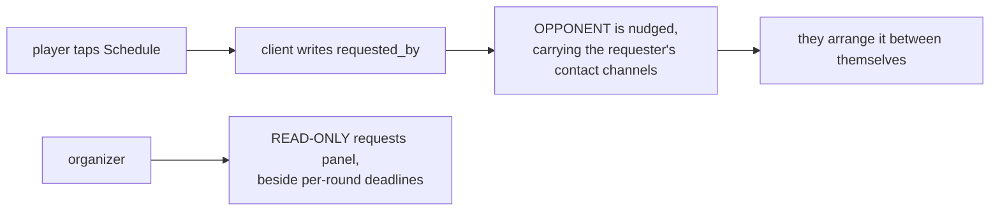

**No dates or times are stored.** The date-bearing scheduled-match indexes retire; the organizer's date / AM-PM / Set controls and their two toasts are deleted; the Profile day-toggle grid goes with them.

**Deadlines** are keyed by **draw and round** and **exclude the RR group stage** — it runs the season. RR **knockout** rounds carry them. The weekly reminder carries the nearest one: _"You have 3 matches to play — earliest deadline 14 Sept"_, falling back to _"Arrange a time with your opponent."_ when the player has no dated match.

**No `requested_by` backfill** ([S5](HARMONIZATION_REPORT.md#S5)) — the old boolean never recorded who asked, so pending requests expire and players re-request.

---

## 15 · Bookings

### 15.1 Now — coupon states

| Transition      | Allowed from                  |
| --------------- | ----------------------------- |
| `use`           | `active`, `flagged`           |
| `flag`          | `active`                      |
| `cancelRequest` | `active`                      |
| `reviewApprove` | `cancel_requested`            |
| `reviewDecline` | `flagged`, `cancel_requested` |

### 15.2 Target — [L11](HARMONIZATION_REPORT.md#L11), [Sprint D5](../../../sprints/d1-d5/SPRINT-D5.md)

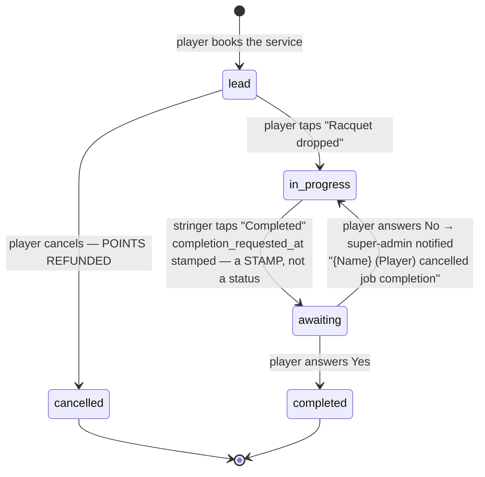

**`cancelled` is reachable from `lead` only.** There is no fourth status. `flagged`, `cancel_requested` and `redemption_locks` are all removed. The catalog moves to `services` behind an owner-gated callable.

---

## 16 · Status vocabulary

| Domain           | Now                                                                      | Target                                             |
| ---------------- | ------------------------------------------------------------------------ | -------------------------------------------------- |
| Tournament match | `pending` · `complete`                                                   | + `score_disputed` **flag**                        |
| Ladder challenge | `open` · `accepted` · `rejected` · `reported` · `confirmed`              | auto-apply; dispute flag replaces the review step  |
| Rally            | `open` · `accepted` · `declined` · `reported` · `confirmed` · `disputed` | same — `disputed` should become the shared flag    |
| Coupon / booking | `active` · `flagged` · `cancel_requested` · `used`                       | `lead` · `in_progress` · `completed` · `cancelled` |
| Claim            | `pending` · `approved` · `rejected`                                      | unchanged                                          |
| Join slot        | `available` · `fallback` · `full`                                        | **all three deleted** — joining always registers   |
| Participant      | `removal` flag / `withdrawn`·`removed`·`inactive`                        | **one `status`**: `active` · `withdrawn`           |
| Schedule         | `scheduled` · `unscheduled`                                              | **deleted**                                        |

**Three near-synonym pairs across domains:** `rejected` (ladder, claim) vs `declined` (rally) · `complete` (match) vs `confirmed` (ladder, rally) vs `used` (coupon) · `removal`/`removed`/`withdrawn`/`inactive` for one participant idea. `CS-24` asks for one four-word match vocabulary; it should cover the cross-domain pairs too, not just the match card.

---

## 17 · Findings not recorded in any decision document

| #       | Finding                                                                                                                                                                        | Impact                                                                                                               | Sprint                                       |
| ------- | ------------------------------------------------------------------------------------------------------------------------------------------------------------------------------ | -------------------------------------------------------------------------------------------------------------------- | -------------------------------------------- |
| **F-A** | `walkover` is a **stored** field on the match while the submission carries `is_walkover` — two names, and `DECISIONS_BRIEF` §1 asserts it is not stored at all                 | Doc contradicts code; one-name-per-thing breach                                                                      | [Sprint D2](../../../sprints/d1-d5/SPRINT-D2.md)         |
| **F-B** | Two "is this participant active?" tests. **A withdrawn player is still scoreable**                                                                                             | `S3` names one of two call sites                                                                                     | [Sprint D4](../../../sprints/d1-d5/SPRINT-D4.md)         |
| **F-C** | `pointswon`/`totalPointsPlayed` are written **by the server on every result**, not only at bootstrap                                                                           | **Moves [L14](HARMONIZATION_REPORT.md#L14) out of [Sprint D1](../../../sprints/d1-d5/SPRINT-D1.md) into Sprint D2/D3**           | Sprint D2                                    |
| **F-D** | `tournamentsPlayed` increments on **every loss**                                                                                                                               | Stored value is wrong, not merely unrendered                                                                         | [Sprint D3](../../../sprints/d1-d5/SPRINT-D3.md)         |
| **F-E** | The margin-of-2 rule exists in **no layer**; set-majority does                                                                                                                 | Scopes [conflict 2](DEV_ANUJ_CONFLICTS.md#2-set-score-bounds--gap) — half is already built                           | Sprint D2                                    |
| **F-F** | The result callable is **organizer-only**; players cannot call it                                                                                                              | Auto-approval is "open the callable + reconcile", not "delete a step"                                                | Sprint D2                                    |
| **F-G** | `result_application` is a separate field today, contra [L3](HARMONIZATION_REPORT.md#L3)                                                                                        | Rename/reshape                                                                                                       | Sprint D2                                    |
| **F-H** | The client auto-derives `isWalkover` from all-zero, supplying the exact flag the server guard asks for                                                                         | Sharpens [LB-1](../ACTION-REPORT.md#LB-1): seed **and** explicit organizer-only switch                               | Sprint D1 + [D2](HARMONIZATION_REPORT.md#D2) |
| **F-I** | The join fallback **rewrites the player's skill** to 4 or 3 based on slot availability                                                                                         | Silent data mutation                                                                                                 | Sprint D4                                    |
| **F-J** | `isCurrentGroupLessonCoachFor` is a fourth `contacts` reader the conflicts doc omits; retires in [Sprint D5](../../../sprints/d1-d5/SPRINT-D5.md)                                          | Cross-sprint dependency Sprint D2 ↔ [D5](HARMONIZATION_REPORT.md#D5)                                                 | Sprint D2                                    |
| **F-K** | Rally `disputed` is a dead-end state with no exit — and the auto-apply ruling now covers friendlies                                                                            | Two answers to one question                                                                                          | Sprint D2                                    |
| **F-L** | Ladder `rejected` has two writers, no shared guard                                                                                                                             | Minor                                                                                                                | backlog                                      |
| **F-M** | **After L14 and [S1](HARMONIZATION_REPORT.md#S1), a same-winner reconcile has no stat consequences.** Every surviving delta depends on winner + round + format, never on games | Row 6 of §1.2 is a **pure score-field update**; full reverse-then-reapply is only needed when the **winner** changes | Sprint D2                                    |

---

## 18 · What is not covered here

- `useTournament.ts` in full — ~2,600 lines on this branch. The result, bonus, knockout-gate and zone paths are covered; the draw-editor and subscription halves are not.
- **`firestore.rules` end to end.** I read the `contacts`, `stats` and score-bound sections only. **A full rules pass is worth doing before [Sprint D2](../../../sprints/d1-d5/SPRINT-D2.md) ships** — that file is the API layer, and the auto-approval change opens a callable to a new class of caller.
- Court Map, Tasks and Marketplace — no multi-state lifecycle, so no diagram would earn its place.
- Anuj's build quality — deliberately out of scope, same as `UI-REMAINING.md`.
