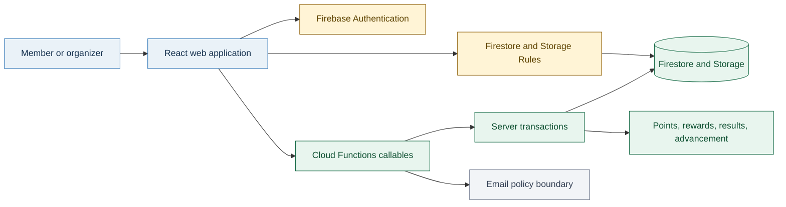
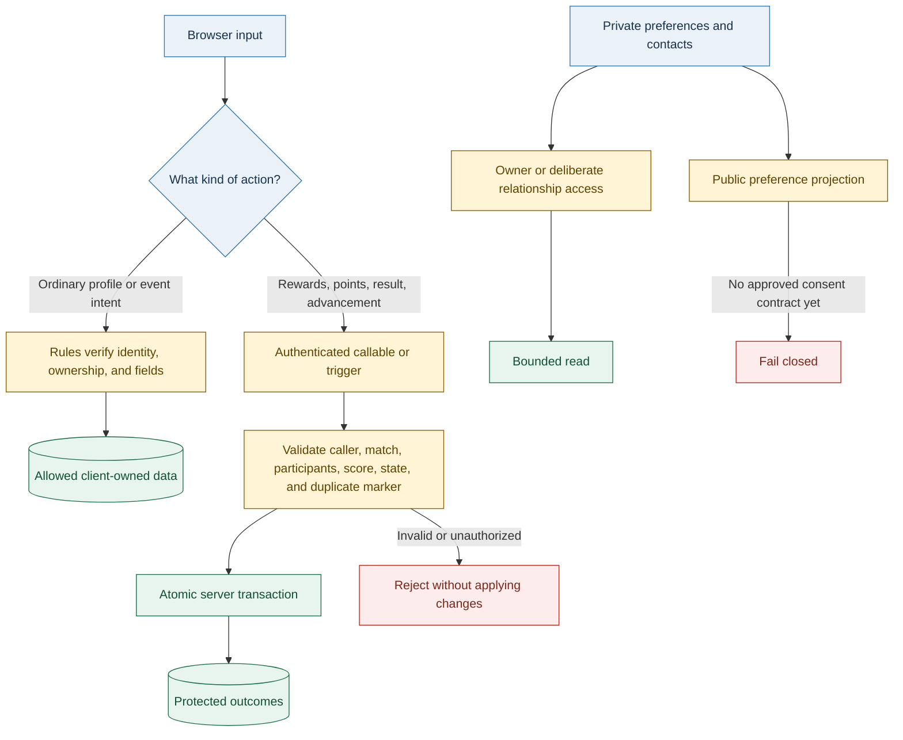
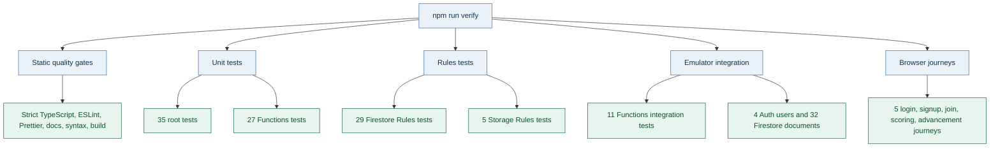
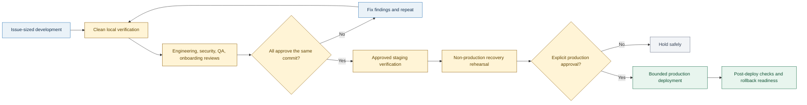

# Founder Technical Overview

> **Archive status (2026-08-25):** Completed `dev-anuj` takeover evidence. Every unfinished outcome
> identified here is represented in the active [master backlog](../../history/BACKLOG-BLG.md).

One visual reference for the current system, delivered engineering work, target state, validation
coverage, important technical documents, and open work on
[`dev-anuj`](https://github.com/tbtctennis/Racquets-And-Strings/tree/dev-anuj).

- **Last reviewed:** 2026-08-25
- **DC00 evidence window:** `4aaf515^..21ddf73`
- **DC00 delivery scale:** 121 commits, 1,727 changed paths, and 444,481 lines of total churn. The
  scoped first-party working set is 289 paths and 38,530 lines of churn. See the
  [DC00 foundation reconciliation](DC00-DEV-ANUJ-FOUNDATION.md) for definitions and comparisons.
- **Branch status:** Development work is delivered on `dev-anuj`
- **Review status:** Repository-local PASS is not yet declared. A complete clean verification run and
  four independent approvals on the same final commit remain pending.
- **Production status:** No production deployment, production data change, DNS change, credential
  configuration, or Firebase provider configuration was performed.

## How to read the status

| Status                       | Meaning                                                                                            |
| ---------------------------- | -------------------------------------------------------------------------------------------------- |
| **Delivered**                | Implemented, committed, and present on the GitHub development branch.                              |
| **Pending local validation** | Repository work exists, but the final uninterrupted verifier and same-commit reviews remain open.  |
| **External gate**            | Requires approved staging, provider, backup, or production access. It is not a repository failure. |

## Current state: what runs today

### What changed from the earlier state

- The browser sends **intent** for protected actions. It no longer directly applies tournament
  points, statistics, rewards, offer economics, or advancement.
- `event_creator` is an **event workflow role**, not a global administrator. Event managers are
  limited to events they own or are explicitly assigned to.
- Important Firestore reads pass through runtime normalization before product code trusts them.
- Signup creates the profile, preferences, statistics, tasks, and contact records through one
  focused persistence boundary rather than inline route code.
- Local emulators, synthetic data, isolated ports, and browser journeys provide repeatable evidence
  without touching production.
- Migrations remain dry-run by default and require an explicit project and confirmation path.

## Current trust model: where important decisions happen

### Founder takeaway

The main protection is no longer “the screen does not show that button.” The protection now lives
in Firestore Rules and server code, where a modified browser cannot bypass it.

## Quality coverage currently in the repository

These are configured reliable test counts. The final PASS claim still requires the complete verifier
to finish on one exact clean commit, followed by all four independent reviews of that same commit.

## Target state: how a release should move

### Target product boundaries still to add

- An explicit consent model before any cross-member preference projection is enabled.
- Bounded server operations for completed-result corrections and manual Round Robin bonus awards.
- Approved staging proof for App Check, account lookup, core user journeys, and configuration.
- A non-production backup and recovery rehearsal with recorded results.
- Dependency audit triage without broad or breaking upgrades.

## In-progress and remaining work

```mermaid
flowchart TD
    Delivered[Delivered on dev-anuj] --> D1[Server-authoritative scoring and rewards]
    Delivered --> D2[Scoped event authority and private data boundaries]
    Delivered --> D3[Runtime normalization and smaller service modules]
    Delivered --> D4[Unit, Rules, integration, fixture, and browser coverage]
    Delivered --> D5[Onboarding, architecture, migration, and safety documentation]

    Pending[Pending local validation] --> P1[Run clean installs and complete npm run verify]
    Pending --> P2[Four fresh independent reviews on one commit]
    Pending --> P3[Fix any findings and repeat all gates]

    External[External gates] --> E1[Approved staging verification]
    External --> E2[Backup recovery rehearsal]
    External --> E3[Provider, DNS, credential, and production approvals]

    classDef done fill:#e8f5ee,stroke:#176b47,color:#0f5132
    classDef pending fill:#fff4d6,stroke:#8a5a00,color:#5f4300
    classDef external fill:#f2f4f7,stroke:#667085,color:#344054
    class Delivered,D1,D2,D3,D4,D5 done
    class Pending,P1,P2,P3 pending
    class External,E1,E2,E3 external
```

## Important technical documents

### Start here by question

| Founder question                         | Document                                                                                                          | What it explains                                                                        |
| ---------------------------------------- | ----------------------------------------------------------------------------------------------------------------- | --------------------------------------------------------------------------------------- |
| What was delivered and what remains?     | [Takeover stabilization log](../../../engineering/TAKEOVER_STABILIZATION_LOG.md)                                     | Chronological delivery evidence, validation history, safety boundaries, and open gates. |
| How did the repository structure change? | [Archived file structure comparison](../../history/planning-2026-08-23/anuj/FILE_STRUCTURE_COMPARISON.md)                    | Historical Version 0 and `dev-anuj` comparison from the closed planning package.        |
| What remains after D1–D5?                | [Master backlog](../../history/BACKLOG-BLG.md) and [future work](../../deferred/FUTURE-WORK.md)                                        | Permanent `BLG####` IDs, source task/bug references, status and promotion rules.        |
| How is the system organized?             | [Architecture index](../../../architecture/README.md)                                                                | The map for architecture, data, authorization, environments, and diagrams.              |
| What protects sensitive workflows?       | [Security baseline](../../../engineering/SECURITY_BASELINE.md)                                                       | Source-level controls, verified boundaries, limitations, and external validation.       |
| Who can do what?                         | [Authorization model](../../../architecture/AUTHORIZATION_MODEL.md)                                                  | Member, event-manager, administrator, and server permissions.                           |
| Can a new engineer run it safely?        | [Local development guide](../../../engineering/LOCAL_DEVELOPMENT.md)                                                 | Install, emulators, synthetic data, tests, browser flow, ports, and safety.             |
| What can be deployed?                    | [Environments and deployment](../../../architecture/ENVIRONMENTS_AND_DEPLOYMENT.md)                                  | Local, source-review, staging, and production evidence are kept distinct.               |
| What are the core product rules?         | [Tournament rules](../../../domain/TOURNAMENT_RULES.md) and [scoring and points](../../../domain/SCORING_AND_POINTS.md) | Established tournament, scoring, no-show, walkover, and points behavior.                |

### Architecture and decisions

| Document                                                                              | Purpose                                                                    |
| ------------------------------------------------------------------------------------- | -------------------------------------------------------------------------- |
| [System architecture](../../../architecture/SYSTEM_ARCHITECTURE.md)                      | Current application structure, runtime services, and ownership boundaries. |
| [Data flow](../../../architecture/DATA_FLOW.md)                                          | Trusted and untrusted paths, including server-authoritative results.       |
| [Data model](../../../architecture/DATA_MODEL.md)                                        | Important collections, projections, and ownership relationships.           |
| [Authorization model](../../../architecture/AUTHORIZATION_MODEL.md)                      | Who may read or change each sensitive product area.                        |
| [Role authorization decision](../../../architecture/ADR-001-role-authorization-model.md) | Why `event_creator` is event-scoped, not a global administrator.           |
| [Environment isolation decision](../../../architecture/ADR-002-environment-isolation.md) | Why production is never the default development target.                    |
| [Firestore schema assessment](../../../architecture/FIRESTORE_SCHEMA_ASSESSMENT.md)      | Data-shape risks, compatibility reads, and migration implications.         |
| [Mobile path recommendation](../../../architecture/MOBILE_PATH_RECOMMENDATION.md)        | Product and engineering considerations for a future mobile surface.        |

### Product and business rules

| Document                                                 | Rule set                                                  |
| -------------------------------------------------------- | --------------------------------------------------------- |
| [Tournament rules](../../../domain/TOURNAMENT_RULES.md)     | Formats, participants, draws, and operating behavior.     |
| [Scoring and points](../../../domain/SCORING_AND_POINTS.md) | Points, score fields, walkover, and no-show semantics.    |
| [Round Robin rules](../../../domain/ROUND_ROBIN_RULES.md)   | Groups, standings, progression, and safe redraw behavior. |
| [Rewards rules](../../../domain/REWARDS_RULES.md)           | Earning, redemption, cancellation, refund, and authority. |
| [Contact privacy](../../../domain/CONTACT_PRIVACY.md)       | When contact information may be exposed and to whom.      |

### Engineering, operations, and recovery

| Document                                                               | Purpose                                                             |
| ---------------------------------------------------------------------- | ------------------------------------------------------------------- |
| [Maintainability](../../../engineering/MAINTAINABILITY.md)                | Strict typing, smaller modules, runtime normalization, and cleanup. |
| [Security baseline](../../../engineering/SECURITY_BASELINE.md)            | Repository-local security evidence and external verification gaps.  |
| [Local development](../../../engineering/LOCAL_DEVELOPMENT.md)            | Safe setup-to-browser-test workflow using synthetic data.           |
| [Agent skills](../../../engineering/AGENT_SKILLS.md)                      | Approved specialist workflows for future engineering sessions.      |
| [Backup and recovery](../../../runbooks/FIRESTORE_BACKUP_AND_RECOVERY.md) | Recovery expectations, rollback thinking, and rehearsal needs.      |
| [Email and DNS runbook](../../../runbooks/RESEND_DOMAIN_VERIFICATION.md)  | External provider and DNS work that remains approval-gated.         |
| [Repository README](../../../README.md)                                | Main developer entry point, commands, and safety warnings.          |

## All other system diagrams

These diagrams provide deeper views. They remain separate so engineers can edit each source without
making this founder overview unreadable.

| Diagram                                                                                               | What to use it for                                                    |
| ----------------------------------------------------------------------------------------------------- | --------------------------------------------------------------------- |
| [Current system architecture](../../../architecture/diagrams/current-system-architecture.md)             | Application, Firebase services, Functions, and external boundaries.   |
| [Core data flow](../../../architecture/diagrams/core-data-flow.md)                                       | How important data moves through authorization and server processing. |
| [Authorization boundaries](../../../architecture/diagrams/authorization-boundaries.md)                   | Member, event-manager, administrator, and server responsibilities.    |
| [Firestore data model](../../../architecture/diagrams/firestore-data-model.md)                           | Major data groups and relationships.                                  |
| [Modernization before and after](../../../architecture/diagrams/modernization-before-after.md)           | Earlier coupled design compared with the newer boundary-based design. |
| [Target safe-delivery architecture](../../../architecture/diagrams/target-safe-delivery-architecture.md) | Intended local-to-staging-to-production approval flow.                |

## Major implementation entry points

| Business capability         | Primary files                                                                                                                                                                                                                                                                              | Outcome                                                                                            |
| --------------------------- | ------------------------------------------------------------------------------------------------------------------------------------------------------------------------------------------------------------------------------------------------------------------------------------------ | -------------------------------------------------------------------------------------------------- |
| Tournament result authority | [`tournamentResults.js`](../../../../functions/tournamentResults.js), [`tournamentResult.js`](../../../../functions/lib/tournamentResult.js), [`tournamentResultService.ts`](../../../../src/features/tournament/services/tournamentResultService.ts)                                               | Server transaction validates and applies results, advancement, statistics, points, and duplicates. |
| Tournament maintainability  | [`scoreSubmission.ts`](../../../../src/features/tournament/domain/scoreSubmission.ts), [`tournamentPersistence.ts`](../../../../src/features/tournament/services/tournamentPersistence.ts), [`tournamentSubscriptions.ts`](../../../../src/features/tournament/services/tournamentSubscriptions.ts) | Validation, persistence, and subscriptions are separated from the route.                           |
| Firestore trust boundaries  | [`firestoreNormalization.ts`](../../../../src/lib/firestoreNormalization.ts)                                                                                                                                                                                                                  | External data is normalized before product code uses it.                                           |
| Signup bootstrap            | [`profilePersistence.ts`](../../../../src/features/signup/profilePersistence.ts), [`signupProfileDocuments.ts`](../../../../src/features/signup/signupProfileDocuments.ts)                                                                                                                       | Multi-document profile creation is atomic and outside the screen component.                        |
| Rewards                     | [`rewards.js`](../../../../functions/rewards.js), [`redemptionState.js`](../../../../functions/lib/redemptionState.js)                                                                                                                                                                            | Balances, duplicate prevention, refunds, and cancellation stay server-authoritative.               |
| Rally match points          | [`rallyPoints.js`](../../../../functions/rallyPoints.js), [`rallyResult.js`](../../../../functions/lib/rallyResult.js)                                                                                                                                                                           | Points require valid participants and genuine confirmation. `friendly*` filenames are retired.     |
| Account lookup              | [`accountLookup.js`](../../../../functions/accountLookup.js)                                                                                                                                                                                                                                  | Deployed lookup requires App Check while local emulator development remains possible.              |
| Event access                | [`eventRepository.ts`](../../../../src/features/events/services/eventRepository.ts), [`eventService.ts`](../../../../src/features/events/services/eventService.ts)                                                                                                                               | Event and participant access use explicit repository and service boundaries.                       |

## Security and delivery enforcement

| File                                             | Why it matters                                                                                              |
| ------------------------------------------------ | ----------------------------------------------------------------------------------------------------------- |
| [`firestore.rules`](../../../../firestore.rules)    | Enforces data access, event scope, private projections, protected statistics, and client intent boundaries. |
| [`storage.rules`](../../../../storage.rules)        | Enforces public, authenticated, and owner-only paths plus type and size limits.                             |
| [`firebase.json`](../../../../firebase.json)        | Defines local emulator and Firebase surfaces.                                                               |
| [`.firebaserc`](../../../../.firebaserc)            | Makes project selection visible and avoids an implicit production workflow.                                 |
| [CI workflow](../../../../.github/workflows/ci.yml) | Runs the same repository verifier without deploying.                                                        |
| [`package.json`](../../../../package.json)          | Holds canonical install, verify, emulator, Rules, integration, and browser commands.                        |
| [`verify.mjs`](../../../../scripts/verify.mjs)      | Orchestrates the reliable local and CI gates.                                                               |

## Test evidence index

| Coverage area                  | Evidence                                                                                                                                                   |               Configured reliable count |
| ------------------------------ | ---------------------------------------------------------------------------------------------------------------------------------------------------------- | --------------------------------------: |
| Root domain and boundary tests | [`tests/unit/`](../../../../tests/unit/)                                                                                                                      |                                      35 |
| Functions unit tests           | [`functions/test/`](../../../../functions/test/)                                                                                                              |                                      27 |
| Firestore Rules                | [`firestore.rules.test.mjs`](../../../../tests/rules/firestore.rules.test.mjs), [`firestore.matrix.test.mjs`](../../../../tests/rules/firestore.matrix.test.mjs) |                                      29 |
| Storage Rules                  | [`storage.rules.test.mjs`](../../../../tests/rules/storage.rules.test.mjs)                                                                                    |                                       5 |
| Functions emulator integration | [`functions.emulator.test.mjs`](../../../../tests/integration/functions.emulator.test.mjs)                                                                    |                                      11 |
| Browser journeys               | [`local-emulator.spec.ts`](../../../../tests/e2e/local-emulator.spec.ts)                                                                                      |                                       5 |
| Synthetic data                 | [`local-fixtures.mjs`](../../../../tests/fixtures/local-fixtures.mjs)                                                                                         | 4 Auth users and 32 Firestore documents |

## Update rule for this file

- Keep this as the single founder-facing technical overview and file inventory.
- Keep high-level current-state, target-state, and in-progress diagrams embedded here.
- Link deeper engineering diagrams instead of duplicating them here.
- Link only durable tracked files available on `dev-anuj`; exclude local-only review artifacts.
- Update the “last reviewed” date and status when the branch evidence changes.
- Refresh test counts only from current verifier output.
- Remove or replace links when files are renamed or retired.
- Never mark a review category PASS unless all four independent reviewers approve the same final
  clean commit.
