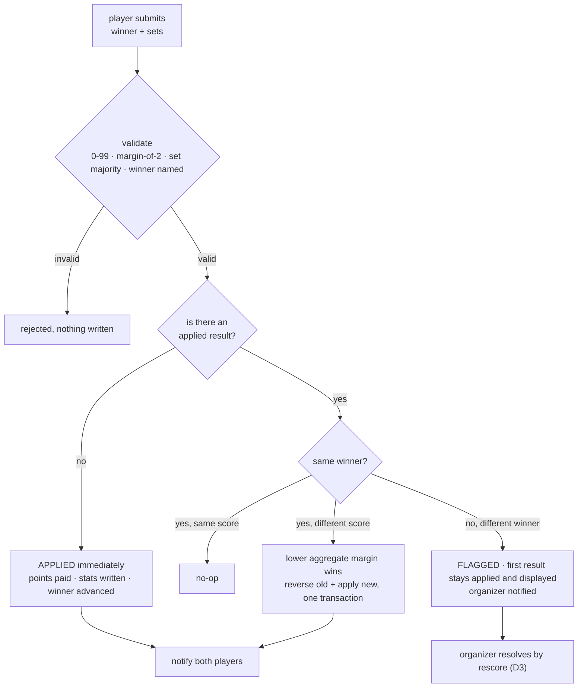

# Sprint D2 — Tuesday 25 August 2026

> **Server authority and the new scoring contract.** The five blocking branch conflicts, plus the
> auto-approval rule that replaces organizer approval on every result in the app.

|                 |                                                                                                                                                                                 |
| --------------- | ------------------------------------------------------------------------------------------------------------------------------------------------------------------------------- |
| **Branch base** | [Sprint D1](SPRINT-D1.md) merge; implemented on `codex/sprint-2-d2`, merged to `dev-anuj` at `9325b3a`                                                                          |
| **Blocking**    | Core D2 implementation is merged; staging remains deferred pending an authorized project and recovery path                                                                      |
| **Replaces**    | `HARMONIZATION_REPORT.md` **[D4](../../history/planning-2026-08-23/notes/HARMONIZATION_REPORT.md#D4)** ("nothing auto-applies") and `WORKFLOW_DESIGN_REPORT.md` §1. Both carry a dated amendment pointing here |
| **Ship**        | Local unit/type/build/rules-emulator validation; staging is deferred until an authorized project and recovery path exist                                                        |

> **Merge record — 25 Aug 2026:** `codex/sprint-2-d2` was validated and fast-forward merged into
> `dev-anuj` at `9325b3a`. No production deployment, migration, or data mutation was performed.

---

## The points table — every number this sprint writes

| Result                            |                Winner |               Loser |
| --------------------------------- | --------------------: | ------------------: |
| RR group — **played** match       |                 **3** |               **1** |
| RR group — **walkover**           |                 **1** |               **1** |
| RR group bonus (organizer switch) |                **+5** |              **+5** |
| Knockout **R32**                  | advances, banks **0** |               **1** |
| Knockout **R16**                  | advances, banks **0** |               **2** |
| Knockout **QF**                   | advances, banks **0** |               **3** |
| Knockout **SF**                   | advances, banks **0** |               **5** |
| Knockout **Final**                |                **20** |              **10** |
| Ladder challenge                  |                **+3** | **−3** floored at 0 |
| Friendly / rally                  |                **+2** |              **+1** |
| ~~No show~~                       |           **removed** |         **removed** |

Source: `src/features/tournament/domain/scoring.ts:56,64-67` and `functions/lib/tournamentResult.js:84`.

---

## Board

| Lane                     | Tasks | Rows                                                                                                                                                                                                       |
| ------------------------ | ----: | ---------------------------------------------------------------------------------------------------------------------------------------------------------------------------------------------------------- |
| **A1 Rules + Functions** |     7 | conflicts 1–5, auto-approval, [D6](../../history/planning-2026-08-23/notes/HARMONIZATION_REPORT.md#D6) walkovers-only                                                                                                                     |
| **A2 Data**              |     4 | [L2](../../history/planning-2026-08-23/notes/HARMONIZATION_REPORT.md#L2), [L3](../../history/planning-2026-08-23/notes/HARMONIZATION_REPORT.md#L3) (amended), [L4](../../history/planning-2026-08-23/notes/HARMONIZATION_REPORT.md#L4), [N2](../../history/planning-2026-08-23/notes/HARMONIZATION_REPORT.md#N2), the submission shape |
| **A3 Client / Dev**      |     4 | wire five callables, [LB-5](../../history/planning-2026-08-23/ACTION-REPORT.md#LB-5), remove client points paths, remove conversion                                                                                                       |
| **A4 UI/UX**             |     4 | ScoreModal rework ([R-5](../../history/planning-2026-08-23/ACTION-REPORT.md#R-5)), dispute banner, notification copy, delete `Stepper`                                                                                                    |
| **A5 Verify**            |     5 | the twelve score examples, three reconcile cases, double-tap, rules matrix, gate                                                                                                                           |

---

## The scoring contract — read this before you write anything

### Validation, identical at three layers

Integers **0–99**. When the higher score exceeds **10**, the margin must be exactly **2**. The winner takes the set majority. A winner must be named.

| Valid                                                        | Invalid               |
| ------------------------------------------------------------ | --------------------- |
| `4-3` `7-2` `7-5` `8-4` `9-3` `10-4` `24-22` `38-40` `94-92` | `12-2` `40-0` `90-40` |

**Today:** the server accepts any 0–99 margin, so `12-2` passes (`functions/lib/tournamentResult.js:1` `MAX_GAME_SCORE = 99`). The rules cap player submissions at 0–7 (`firestore.rules:143` `boundedScore`), so `8-4` and `24-22` are **rejected**. Three layers disagree and valid scores are refused.

### Auto-approval



**Margin** = Σ(winner's games) − Σ(loser's games), across every set present. **Tie → the first submission stands.**

### Worked example — the reconcile

Quarter-final. Chandra beat Rahul.

| Step | Submission                          |                 Margin | Result                                                                |
| ---- | ----------------------------------- | ---------------------: | --------------------------------------------------------------------- |
| 1    | Chandra: `7-0, 7-0`, winner Chandra | (7+7) − (0+0) = **14** | Applied. Chandra → SF. Rahul banks **QF = 3**. Chandra banks **0**    |
| 2    | Rahul: `7-2, 7-4`, winner Chandra   |  (7+7) − (2+4) = **8** | **8 < 14 → `7-2, 7-4` records.** Reverse + reapply in one transaction |
| —    | Points                              |                        | **Unchanged** — 3 to Rahul, 0 to Chandra. Only games move             |

Had Rahul submitted **himself** as winner: nothing changes, `7-0, 7-0` stays applied and on the card, the match flags, both players see _"Result disputed — organizer reviewing"_, the organizer gets one notice.

### Notifications — exact strings

| Recipient               | String                                                                                             |
| ----------------------- | -------------------------------------------------------------------------------------------------- |
| Winner                  | **"Win recorded — 7-2, 7-4 v. Rahul"**                                                             |
| Loser                   | **"Score recorded — 2-7, 4-7 v. Chandra"**                                                         |
| On a margin reconcile   | Both re-notified with the final score, same two strings                                            |
| Organizer, on a dispute | **"Result disputed — Chandra v. Rahul, QF"** — one notice, to `creator_id` **and** `organizer_ids` |

Scores are always shown from the recipient's own perspective.

### Rules that do not bend

1. **Walkovers are organizer-only.** A walkover is all-zero scores plus a winner. A player-submitted all-zero result is **rejected**, or `LB-1` returns through the front door.
2. **Only the two participants may submit.** Doubles: either captain. `BYE` and `PLAYER_LOADING` sentinels are excluded from everything — connections, stat deltas, notifications.
3. **A blank `winner_uid` is refused.** It completes the match displaying player 2 as winner, credits player 1 with a loss, awards nobody a win, and writes an empty uid into the next round.
4. **The organizer can rescore any match, any number of times.** `result_at` re-stamped each time; `completed_at` **pinned at first scoring**; every edit logged. Re-editing used to overwrite `completed_at` with "now", corrupting streaks, months-active and best-finish.
5. **A winner flip is refused when the next match already holds a completed or submitted result.** Approval never overwrites a played slot.
6. **Scope is all three:** tournament matches, ladder challenges (+3/−3), friendlies (+2/+1).

---

## A2 · Data — `dev-data`

### ⬛ The submission shape · **amends L3**

`L3` put the idempotency hash inside `score_pending`. There is no pending block on the normal path any more, so the field is renamed and re-shaped.

```jsonc
// matches/{matchId}
{
  // the applied result — unchanged field names
  "winner_uid": "chandra_uid",
  "set_1_player_1": 7,
  "set_1_player_2": 2,
  "set_2_player_1": 7,
  "set_2_player_2": 4,
  "set_3_player_1": 0,
  "set_3_player_2": 0,
  "result_at": "2026-08-25T14:02:11Z", // L2 — re-stamped on every apply
  "completed_at": "2026-08-25T13:47:03Z", // pinned at FIRST scoring, never rewritten

  // who said what — the reconcile input
  "result_submissions": {
    "chandra_uid": {
      "winner_uid": "chandra_uid",
      "sets": [
        [7, 0],
        [7, 0],
      ],
      "margin": 14,
      "submitted_at": "2026-08-25T13:47:03Z",
      "hash": "…",
    },
    "rahul_uid": {
      "winner_uid": "chandra_uid",
      "sets": [
        [7, 2],
        [7, 4],
      ],
      "margin": 8,
      "submitted_at": "2026-08-25T14:02:11Z",
      "hash": "…",
    },
  },

  // dispute, set only when the two submissions name different winners
  "score_disputed": false,
  "score_disputed_at": null,
}
```

- **`margin` is stored** because the server would otherwise recompute it on every read to render the reconcile, and it is not derivable from the applied result alone (it belongs to a submission, not to the match).
- **`hash`** is the idempotency marker — a replayed identical submission is a no-op.
- **`score_pending` retires.** `no_show` retires with [D6](../../history/planning-2026-08-23/notes/HARMONIZATION_REPORT.md#D6).

### ⬛ L2 · `result_at`

Add it. Stamped on every apply and every reverse-and-reapply.

### ⬛ L4 · `organizer_ids` on `events`

Per-event assignment. `providers` rows carry roles, not assignments — that distinction is the whole of the Sprint 5 role model, so get the field right now.

### ⬛ N2 · The bonus stamp is `rr_groupbonus`

One name. The current field is `rr_group_bonus_v2` (`src/features/tournament/types.ts:73`, `firestoreNormalization.ts:191`, `RRGroupCard.tsx:92`, `useTournament.ts:2494`). Migrate, union-whitelist during the deploy, strip after hosting is out.

**A2 verification** · dry-run diffs in the report · `npm test`

---

## A1 · Rules + Functions — `rules-functions`

### ⬛ Conflict 1 — Organizer rescore · `BROKEN`

**File** · `functions/tournamentResults.js:100`

```js
'This match already has a different applied result. Reset it before rescoring.',
```

The callable refuses a different result on a completed match — while reset and cancel are **disabled stubs**. A mis-scored match is uncorrectable today.

**Build** · reverse-then-reapply in the same transaction. `mergeStatDeltas(…, -1)` at `functions/lib/tournamentResult.js:166` exists and is test-only today; make it the reverse half. Stamp `result_at`. Leave `completed_at` alone. Log actor and before/after to the `tournament` change log (**[D1](../../history/planning-2026-08-23/notes/HARMONIZATION_REPORT.md#D1)** — the change log _is_ the audit; there is no submissions collection).

**Done when** · two successive edits leave stats equal to a fresh recompute · `completed_at` unchanged · a replayed identical edit is a no-op.

---

### ⬛ Conflict 2 — Score bounds · `GAP`

**Files** · `functions/lib/tournamentResult.js:1` · `firestore.rules:143` (`boundedScore`), `:149-151` · `src/features/tournament/domain/scoreSubmission.ts:24` (A3 owns the form half)

**Build** · one predicate, three implementations that agree: integers 0–99; if `max(a,b) > 10` then `|a−b| == 2`; winner takes the set majority. Raise the rules cap from 7 to 99 **and add the margin rule there too** — the rules are the API layer, and a cap alone lets `40-0` through.

**Done when** · all twelve examples pass or fail identically at form, rules and callable · a unit test pins them.

---

### ⬛ Conflict 3 — Ladder confirmation · `BROKEN`

**File** · new `challengeResults` callable · `src/features/leagues/ladderService.ts:148-190` (A3 wires it)

`confirmChallenge` writes stats **from the client** and is denied by the branch's own rules, so **every confirm fails today**. The rules confirm branch admits only players and the super-admin; the ladder event's **manager** should be the authority (**[D2](../../history/planning-2026-08-23/notes/HARMONIZATION_REPORT.md#D2)**).

**Build** · `challengeResults` callable. **+3 / −3, loser floored at 0.** The floor needs a read-then-write, so this is a **transaction, not a batch** — in a plain batch two concurrent confirms both read the same starting value and one −3 is silently lost. Read the applied flag **inside** the transaction: a mobile double-tap otherwise applies ±3 twice, winner +6 and loser −6, and those phantom points are spendable on Services. All writes `set(…, { merge: true })` so a player with no `stats` doc cannot reject the whole thing and strand the challenge in `reported`.

Restore the event-manager authority at `firestore.rules:428`. Challenges keep `event_id` (**[L1](../../history/planning-2026-08-23/notes/HARMONIZATION_REPORT.md#L1)**, **D2**).

**Done when** · a manager confirm pays once under emulator rules tests · a double-tap pays once · a non-manager is rejected.

---

### ⬛ Conflict 4 — RR group bonus · `BROKEN`

**File** · new `setGroupBonus` callable · stub at `src/pages/tournament/useTournament.ts:2231`

```ts
// Bonus point mutation stays disabled until its own bounded server operation is available.
const handleSetGroupBonus = async (_rrGroup: number, _award: boolean) => { … }
```

**Build** · manager check; stamp or unstamp `rr_groupbonus` on **every** match in the group and pay or reverse **+5** to every member, in **one transaction**. No-op when the stamp already matches the requested state.

The stamp is the **only proof of payment**. It used to pay automatically when the last match completed, keyed off `status !== 'complete'` — which only means _this_ match was unscored. So a corrected match re-confirmed paid a second +5 while a later reset removed only 5, leaving a permanent surplus. Reversal requires the stamp, or a reset takes 5 points players never received.

The organizer may award a group that still has unplayed matches, so **reversal must not gate on completeness**.

**Done when** · on pays each member exactly +5 once · off removes exactly +5 · repeats are no-ops · non-manager rejected.

---

### ⬛ Conflict 5 — Organizer contact access · `GAP`

**Files** · `functions/connections.js` · `firestore.rules:208-216` (contacts)

An event organizer cannot read the contacts of members signed up to their own event, so a non-super-admin creator's bracket image renders blank contacts.

**Build** · a new `onParticipantJoin` trigger writing one `connections/{organizer__player}` pair per organizer, reusing `hasActiveEventParticipant`. Delete the super-admin read from the contacts rule (**[F6](../../history/planning-2026-08-23/notes/WORKFLOW_DESIGN_REPORT.md#F6)**, **[L13](../../history/planning-2026-08-23/notes/HARMONIZATION_REPORT.md#L13)**) — the owner's full-data access is the database export, not in-app profile viewing. `useContacts.ts` and `bracketImage.ts` need no change.

`pairId()` exists in **both** `functions/connections.js` and `firestore.rules` and **must stay byte-identical**, or every contact read in the app starts failing.

Also this sprint: **`preferences` becomes public** (**[R7](../../history/planning-2026-08-23/notes/HARMONIZATION_REPORT.md#R7)**, **[PD1](../../history/planning-2026-08-23/notes/DECISIONS_BRIEF.md#PD1)**, **F6**) — member choices only; role and provider fields move to `providers` in Sprint 5.

**Done when** · a non-super-admin creator downloads a bracket image with contacts populated for their participants · is denied for a non-participant · **loses the read on withdrawal**.

---

### ⬛ NEW — Auto-approval, margin reconcile, dispute flag

**File** · `functions/tournamentResults.js`, `functions/lib/tournamentResult.js`, plus the challenge and friendly paths

Implement the contract above. Three cases, in this order:

```text
1. no applied result            → validate, apply, pay, advance, notify both
2. applied, same winner
   2a. identical score          → no-op (hash match)
   2b. different score          → lower margin wins; if the incoming margin is lower,
                                  reverse old + apply new in ONE transaction, re-notify both;
                                  if higher or equal, keep the applied result
3. applied, different winner    → do not touch the result. Set score_disputed = true,
                                  stamp score_disputed_at, notify the organizer once.
                                  Both players see the banner. Advancement is NOT rolled back.
```

Resolution is the organizer's normal rescore ([conflict 1](../../history/planning-2026-08-23/notes/DEV_ANUJ_CONFLICTS.md#1-organizer-score-editing--broken)), which clears the flag. If the flip would change a knockout winner and the next match already holds a completed or submitted result, **refuse with a message**.

**Done when** · each of the three cases has an integration test · a replayed submission is a no-op · a player-submitted all-zero result is rejected · a non-participant submission is rejected.

---

### ⬛ D6 / L10 — Walkovers only

Remove `no_show` from the model, from the points path, and remove the `is_walkover` cross-check.

- `functions/lib/tournamentResult.js:160` `noShow: match.no_show === true` — delete the branch.
- `functions/tournamentResults.js:199` `no_show: result.noShow` — delete.
- `functions/tournamentResults.js:38-46` `submissionMatchesResult` compares `submission.is_walkover === result.walkover` — **delete the check.** `is_walkover` is not stored; a walkover is all-zero scores plus a winner, and the defect logged against this check is moot.
- `src/features/tournament/domain/scoring.ts:20,50-51` `NO_SHOW_POINTS` and its branch — delete.

**Payout after removal — the walkover absorbs the no-show's 1/1 in the group stage:**

| Stage                     |            Winner |                                                                      Loser |
| ------------------------- | ----------------: | -------------------------------------------------------------------------: |
| RR group **walkover**     |             **1** |                    **1** — both players, because it is not a played result |
| RR group **played** match |                 3 |                                                              1 — unchanged |
| Knockout **walkover**     | advances, banks 0 | that round's award: R32 **1** · R16 **2** · QF **3** · SF **5** · F **10** |

This is a **change from the current code**, which pays a walkover the full 3/1 in a group. `CLAUDE.md` documents the old rule and is corrected in [Sprint D3](SPRINT-D3.md) step 16. Sources: `DECISIONS_BRIEF` §1 · `HARMONIZATION_REPORT` [D6](../../history/planning-2026-08-23/notes/HARMONIZATION_REPORT.md#D6) and [L10](../../history/planning-2026-08-23/notes/HARMONIZATION_REPORT.md#L10) · `ACTION-REPORT` Q-4 (closed).

**A player who fails to appear is not a walkover** — the organizer records a real **6-0** and it pays as a normal result. The walkover covers a match **neither** player played.

`matchAward` and `computeGroupStandings` must carry this identically and **change in the same commit**.

**A1 verification** · `npm run test:rules` · `npm run test:storage` · `cd functions && npm test` · `npm run test:functions:integration`

---

## A3 · Client / Dev — `dev-client`

### ⬛ Wire the five callables

| Stub / client write                                              | Becomes                                                                                        |
| ---------------------------------------------------------------- | ---------------------------------------------------------------------------------------------- |
| `useTournament.ts:2231` `handleSetGroupBonus`                    | call `setGroupBonus`, surface its errors                                                       |
| `useTournament.ts` reset / cancel stubs                          | call the rescore path                                                                          |
| `ladderService.ts:148-190` `confirmChallenge` client stat writes | call `challengeResults`; delete the client writes                                              |
| score submission                                                 | goes through the result callable; **the client no longer computes or applies points anywhere** |

**Do not reimplement any of this client-side.** Removing client points authority is the whole of the server-hardening work already on this branch.

### ⬛ LB-5 — Three validation layers reconciled

**File** · `src/features/tournament/domain/scoreSubmission.ts:19-24`

The form caps at 30, the rules cap at 0–7, the contract says 0–99. Make the form implement the exact contract: integers 0–99, margin exactly 2 above 10, winner takes the set majority. [R-5](../../history/planning-2026-08-23/ACTION-REPORT.md#R-5) replaces the ± steppers with number fields — that is A4's edit; you own the validator behind it.

### ⬛ Remove the conversion

Delete the "Also count as a Challenge" checkbox path and `proposeConversion`. One physical match counts once.

### ⬛ Remove every client no-show path

`ScoreModal`'s no-show prop threading, the `RRGroupCard` no-show branches, the no-show toast in `useTournament.ts`. A4 deletes the UI; you delete the wiring.

**A3 verification** · `npm run typecheck` · `npm run lint` · `npm test`

---

## A4 · UI/UX — `ui-ux`

### ⬛ ScoreModal rework · R-5

**File** · `src/pages/tournament/ScoreModal.tsx`

| Line           | Now                                                              | After                                                                                                                                                          |
| -------------- | ---------------------------------------------------------------- | -------------------------------------------------------------------------------------------------------------------------------------------------------------- |
| `:121`         | `const selected = !isNoShow && scoreForm.winnerUserId === p.uid` | unchanged — but [D1](../../history/planning-2026-08-23/notes/HARMONIZATION_REPORT.md#D1) made `winnerUserId` start empty, so **neither card is selected on open**. Verify it renders that way |
| `:110`         | _"…The organizer will confirm it."_                              | _"Pick the winner, enter the games, and submit. The result is recorded straight away."_                                                                        |
| `:191`, `:200` | `<Stepper …>`                                                    | **number entry fields** (`field-dense`). ± to 99 was never usable, and it dissolves the 0–99 reachability problem                                              |
| `:231-239`     | the "Count As No Show" checkbox and its prop                     | **delete** — the whole no-show concept goes                                                                                                                    |
| `:193-204`     | "Also count as a Challenge" checkbox                             | **delete**                                                                                                                                                     |
| new            | —                                                                | an explicit **Walkover** switch, **rendered for organizers only**                                                                                              |
| `:87`          | passes **no `title`** to `Sheet`                                 | pass one. The app's most-used modal currently announces unnamed                                                                                                |

Then **delete `src/components/Stepper.tsx`** and its `.design-sync` preview — verify `grep -rn 'Stepper' src/` returns nothing first. Its only two consumers were `:191` and `:200`.

### ⬛ Dispute banner and the notification strings

- Banner on the match card when `score_disputed` — _"Result disputed — organizer reviewing"_. Use `AlertMessage`; `text-badge` for the warning tone, never `text-amber-300`, which does not flip and washes out on light surfaces.
- The applied result stays visible **underneath** the banner. The first submitted result is what shows until the organizer resolves.
- Notification copy: winner _"Win recorded — {score} v. {opponent}"_, loser _"Score recorded — {score} v. {opponent}"_, scores from the recipient's perspective.

### ⬛ `MatchCard` submitted state

`MatchCard.tsx:203` reads `"Submitted ✓ awaiting confirmation"`. Nothing awaits confirmation any more. Replace with the recorded state.

**A4 verification** · `npm run typecheck` · `grep -rn 'Stepper\|no_show\|No Show' src/` → 0 · `.design-sync` diff both cells

---

## A5 · Verify — `dev-verify`

### ⬛ The twelve score examples

One table-driven test asserting identical pass/fail at **form**, **rules** and **callable**:

`4-3` `7-2` `7-5` `8-4` `9-3` `10-4` `24-22` `38-40` `94-92` valid · `12-2` `40-0` `90-40` invalid.

### ⬛ The three reconcile cases

| Case                         | Assert                                                                                             |
| ---------------------------- | -------------------------------------------------------------------------------------------------- |
| Same winner, same score      | No second payout; hash no-op                                                                       |
| Same winner, different score | `7-0,7-0` then `7-2,7-4` → applied score is `7-2,7-4`; **points unchanged**; both re-notified      |
| Different winner             | Applied result unchanged; `score_disputed` true; one organizer notice; advancement not rolled back |

Plus: a player-submitted all-zero result is rejected · a non-participant submission is rejected · a blank `winner_uid` is rejected at all three layers.

### ⬛ Conflict gates

| Conflict | Gate                                                                                                            |
| -------- | --------------------------------------------------------------------------------------------------------------- |
| 1        | Two successive edits = fresh recompute; `completed_at` unchanged; replay is a no-op                             |
| 2        | The twelve examples                                                                                             |
| 3        | Manager confirm pays once; **double-tap pays once**; non-manager rejected                                       |
| 4        | On = +5 once; off = −5; repeats no-op; a group with unplayed matches can still be awarded and reversed          |
| 5        | Creator downloads a bracket image with contacts; denied for a non-participant; **loses the read on withdrawal** |

### ⬛ Exit gate

All five conflicts flip to `RESOLVED` in `DEV_ANUJ_CONFLICTS.md` §Summary. `grep -rn 'no_show\|NO_SHOW_POINTS\|is_walkover' src/ functions/` returns **0**. The three journeys above are in `tests/`.

---

## Handoffs into Sprint D3

| From | To  | What                                                         |
| ---- | --- | ------------------------------------------------------------ |
| A1   | A5  | Callable signatures, for the rules matrix                    |
| A2   | A3  | The `result_submissions` shape, for the stat-definition pass |
| A4   | all | `Stepper.tsx` is gone — anything importing it breaks `tsc`   |
